# VẤN ĐẠO — Đặc tả v1.0

**Tác giả:** hanhnt2 (hanhnt2@hblab.vn)
**Plugin:** `van-dao` · **Lệnh:** `/vd:*` · **Giấy phép:** MIT

Đây là bản đặc tả chính thức đầu tiên. Bản này tự đủ — không cần đọc kèm bản nào khác.

---

# 0 · BẢNG TRA

Đọc trước. Đặc tả dùng hai lớp từ vựng song song — thế giới quan cho người dùng, kỹ thuật cho người dựng.

## 0.1 Thế giới quan

| Từ | Là gì trong hệ |
|---|---|
| **Vấn đạo** | Tên plugin. Con đường người học đi |
| **Tông môn** | Nơi bái sư và ở lại. Một lần cài, một hồ sơ |
| **Phàm nhân · đệ tử** | Người học, trước và sau khi bái sư |
| **Bí kíp** | Một quyển sách nhiều chương, đã thu vào kho |
| **Tàn quyển** | Bài lẻ — một bài web, một chương rời. Không có lộ trình |
| **Tàng kinh các** | Kho sách **riêng của từng người**. Repo không chứa quyển nào |
| **Công pháp** | Bí kíp theo vai — học được là dùng ngay |
| **Tâm pháp** | Bí kíp theo năng lực nền — chậm, mang sang mọi vai |
| **Mạch** | Một trục năng lực. Cảnh giới đo trên mạch |
| **Cảnh giới** | Năm bậc Dreyfus: Luyện Khí · Trúc Cơ · Kết Đan · Nguyên Anh · Hoá Thần |
| **Lộ đồ** | Kế hoạch học cả quyển, **trình người học duyệt** trước khi bắt đầu |
| **Bế quan** | Học một chương |
| **Nghiệm công** | Chấm bài một chương |
| **Khảo thí** | Thi cuối quyển. **Qua là đột phá quyển — tiêu chí đạt của cả hệ** |
| **Đột phá** | Lên một bậc: chương · quyển · cảnh giới trên mạch |
| **Thoái cảnh** | Tụt bậc khi định lại mà không có căn cứ mới |
| **Hạ sơn lịch luyện** | Mang ra dùng ở việc thật. Ngoài hệ, không đo được |
| **Phục mệnh** | Về báo cáo sau lịch luyện — nhận cả báo cáo thất bại |
| **Tâm ma** | Cách làm cũ người học mang sẵn vào, bẻ cong thứ dạy sau |
| **Tẩu hoả nhập ma** | Đọc nhiều, nói trôi chảy, chưa từng làm |
| **Chú giải** | Lớp bồi của người học chồng lên bí kíp. Bí kíp gốc bất biến |
| **Đạo tâm** | Sổ nhật ký con đường. Không phải tiêu chí đạt |
| **Xuất quan** | Bỏ giữa chừng — **tạm dừng**, không phải dứt |
| **Kiêm tu** | Luyện nhiều mạch cùng lúc. *(Tán tu là người tu ngoài mọi tông môn — khác nghĩa)* |

**Tám vai:** Trưởng môn · **Tàng kinh trưởng lão** (giám định và thu sách) · Thư linh · Giám khảo · **Trưởng lão mạch** (định cảnh giới) · nghiệm công · phúc khảo · chú giải. Xem §4.

*Hai trưởng lão, đừng lẫn:* **Tàng kinh** coi kho sách; **Trưởng lão mạch** đo cảnh giới trên một trục.

## 0.2 Kỹ thuật

| Từ | Nghĩa |
|---|---|
| **Harness** | Mọi thứ quanh model làm nó thành agent: ngữ cảnh, tool, ràng buộc đầu ra, vòng lặp sửa |
| **Subagent tươi** | Ngữ cảnh sạch: system prompt riêng + skill khai trong `skills:`. **Không phải fork** |
| **Fork** | Nạp nguyên hội thoại agent cha. **Cấm dùng cho việc chấm** |
| **`pham_vi_doc`** | Phạm vi đường dẫn khai trong thư. Phải là tập con của `doc` trong `.pham-vi.json` (R27) |
| **Context rot** | Chất lượng giảm dần khi ngữ cảnh dài. Là **dốc, không phải vách** |
| **Compaction** | Nén phiên. Ở đây là **tái dựng từ file + chưng phần dư**, không phải tóm tắt |
| **Điểm neo** | Ghi sau mỗi ý: đang ở ý nào, câu hỏi nào treo, đã dùng cách nào |
| **Chỉ ghi thêm** | Đổi trạng thái là thêm dòng mới. Trạng thái hiện tại là dòng gần nhất |
| **`.pham-vi.json`** | File gác cửa mỗi thư mục con của `ban-giao/`: ai ghi, những vai nào đọc |
| **Nhãn vs dấu hiệu** | *Nhãn* là bậc cảnh giới, cần đủ bằng chứng mới nói. *Dấu hiệu* là thứ quan sát được trong bài, nói được ngay (§5.10) |
| **Loại 1 · 2 · 3** | Phải lưu nguyên văn · sinh tại chỗ · cache dựng lại được (§5.9) |
| **Trigger eval** | Kiểm skill có được gọi đúng lúc không |
| **Behavioral eval** | Kiểm skill chạy có ra đúng thứ không |
| **κ** | Mức khớp giữa nhãn người và bậc model. **< 0,6 thì không công bố bậc** |
| **Tiêu chí không phân biệt** | Tiêu chí mà người chưa đọc chương cũng đạt |
| **Ca đối chứng** | Chạy hai lần, một lần cố tình thêm ngữ cảnh cấm, để tách lỗi harness khỏi lỗi model |

---

# 1 · SẢN PHẨM

## 1.1 Là gì

Một plugin Claude Code biến sách người học **đã có** thành lộ trình học có người kèm.

**Đưa người học tới đâu:** hiểu vững nội dung và **vận dụng được vào một tình huống**. Bước ra việc thật là chuyện của họ — hệ mở đường (§7.3 hạ sơn) nhưng không hứa, và không đo.

**Thế giới quan.** Người học là **phàm nhân** muốn đi trên con đường **vấn đạo**, nên **bái sư gia nhập tông môn**. Tông môn là nơi ở lại; Vấn Đạo là con đường đi. Sách là **bí kíp** (nhiều chương) hoặc **tàn quyển** (bài lẻ). Tám vai, chia hai nhóm:

| Nhóm | Vai | Nói với người học? |
|---|---|---|
| **Dẫn đường và dạy** | Trưởng môn · Tàng kinh trưởng lão · Thư linh · Giám khảo | Có |
| **Soát và ghi nhận** | Trưởng lão mạch · nghiệm công · phúc khảo · chú giải | Không |

Cộng **đệ tử** — người học cũng là một chủ thể ghi (§4.2), không chỉ là đối tượng.

**Kho sách là của riêng từng người.** Repo không chứa quyển nào. Người học tự kiếm PDF/EPUB về và thu vào tàng kinh các của mình.

**Hai loại bí tịch:**

| | Theo | Đặc tính |
|---|---|---|
| **Công pháp** | Vai (BA · tester · dev · lead) | Học được là dùng ngay, gắn với nghề |
| **Tâm pháp** | Năng lực nền (tư duy · giao tiếp · dẫn dắt) | Chậm, mang sang mọi vai |

Trong truyện, **tâm pháp quyết định trần của công pháp** — luyện chiêu mãi không lên nổi thường vì thiếu nội công. Đây không phải màu sắc: nó là luật gợi ý ở §9.

## 1.2 Vì sao nhiều vai, không phải một

Bốn mệnh đề nền:

1. Người học có **khoảng cách** giữa việc muốn làm được và việc làm được.
2. Nội dung mô tả cách làm là **hàng hoá sẵn và rẻ** — sách, blog, video, và cả AI trả lời trực tiếp.
3. **Đọc suông không thu hẹp khoảng cách.** Phải vận dụng vào một tình huống rồi nhận phản hồi.
4. Người tự học **bỏ cuộc vì mất phương hướng** nhiều hơn vì thiếu tài liệu.

Từ đó, người học phải trả lời liên tục ba câu ở ba nhịp khác nhau:

| Câu hỏi | Nhịp | Cần nhìn gì | Vai |
|---|---|---|---|
| Luyện mạch nào tiếp? | Xong một mạch | Toàn bản đồ + lịch sử | **Trưởng môn** |
| Ta đang ở cảnh giới nào? | Sau nhiều bí kíp cùng mạch | Nhiều bài nghiệm công, nhiều nguồn | **Trưởng lão mạch** |
| Chương này đã thấm chưa? | Mỗi chương | Một chương + tình huống thật | **Thư linh** |

Ba câu không gộp được vì ba tầm nhìn khác nhau. Bỏ vai nào cũng mất đúng một câu không ai trả lời.

Năm vai còn lại sinh ra từ **tách trách nhiệm**, không từ thêm câu hỏi mới:

| Tách | Vì sao |
|---|---|
| **Tàng kinh trưởng lão** khỏi thư linh | Thu sách vào kho là việc một lần; dạy là việc lặp lại. Trộn thì thư linh mang cả logic giám định vào mỗi lượt dạy |
| **Giám khảo** khỏi nghiệm công | Coi thi và chấm thi là hai người — cùng một vai thì nó **nới đề cho vừa bài** |
| **nghiệm công** khỏi thư linh | Người dạy không được là người cấp chứng nhận |
| **phúc khảo** khỏi nghiệm công | Hai người soát cùng cơ chế chỉ tốn gấp đôi; trực giao mới bắt được lỗi khác loại (§9) |
| **chú giải** khỏi thư linh | Nó là vai duy nhất có đầu ra rời khỏi máy người học — cần phạm vi đọc hẹp riêng |

## 1.3 Đạt khi

**Luyện xong một bí kíp tới `canh_gioi_ra` của nó — tức qua được khảo thí quyển.**

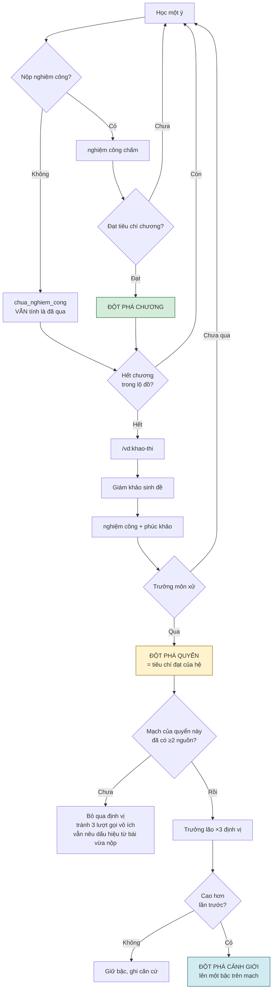

Ba tầng đột phá, tiêu chí của cả hệ nằm ở tầng giữa:

| Tầng | Đột phá khi | Ai xác nhận |
|---|---|---|
| **Chương** | Nghiệm công đạt `tieu_chi_dat` của chương | Thư linh |
| **Quyển** | **Qua khảo thí quyển** | `nghiem-cong` |
| **Mạch** | Đạt cảnh giới trên trục, xuyên nhiều quyển | Trưởng lão ×3 |

**Bậc là nhãn, khảo thí là thước.** `canh_gioi_ra` do pha 2 khai và chính người học duyệt — nếu bậc tự nó là tiêu chí thì người học đang tự đặt vạch rồi tự vượt, và vạch sẽ trôi xuống theo thời gian. Nên đột phá quyển **không bao giờ** do ai tuyên bố đã tới bậc; nó là kết quả của một khảo thí có `tieu_chi_dat` quan sát được.

Ba trường khai cùng lúc ở pha 2, neo lẫn nhau: `canh_gioi_ra` (bậc mục tiêu) · `khao_thi` cấp quyển (tình huống phải giải được) · `tieu_chi_dat` của khảo thí (dấu hiệu quan sát được).

**Không cần đủ chương xương sống.** Ai qua được khảo thí bằng đường khác — đã biết sẵn, học từ nguồn khác — thì qua. Hệ không gác cổng, kể cả gác nhân danh việc học đủ. Chương **bỏ qua nghiệm công vẫn tính là đã qua**; cái giá người học tự chịu là chương đó không có bằng chứng làm nguồn định vị.

**Đột phá mạch = lên một bậc**, không phải tới bậc cao nhất. Mỗi lần định vị cao hơn lần trước là một lần đột phá cảnh giới. Bậc cao nhất không phải đích — nó là chỗ thang đo hết chia độ.

**Định vị chạy tự động sau mỗi đột phá quyển**, kèm hai chốt chặn:

| Chốt | Vì sao |
|---|---|
| Bỏ qua nếu mạch đó chưa đủ **≥2 nguồn** | R10 sẽ trả *"chưa đủ dữ liệu"*; chạy là mất ba lượt gọi model để nhận về con số không |
| `chi-duong` ý định 4 **đọc kết quả có sẵn**, không gọi lại | Định vị đã chạy ở mốc tự nhiên; hỏi lại không có dữ liệu mới |

Hai chốt này làm tổng chi phí **giảm** so với bản cũ: trước đây mỗi câu *"ta đang ở đâu"* là ba lượt gọi; giờ định vị chạy đúng một lần mỗi đột phá quyển, và mọi lần hỏi sau đó đều đọc cache.

## 1.4 Hai nguyên tắc nền

**Không gác cổng.** Hệ tự nguyện: gian lận là tự hại, không có ai để lừa. Mọi phán quyết là **phản chiếu** trả về người học, không phải cửa chặn.

**Học phải vui.** Nghi thức, xưng hô, cách gọi tên cột mốc là **bộ phận của sản phẩm**, không phải lớp sơn — với hệ tự nguyện thì bỏ cuộc là rủi ro số một.

Ranh giới giữa vui và nịnh: **vui đến từ nghi thức và tiến bộ có thật, không từ lời khen.** *"Ngươi giỏi lắm"* là sycophancy. *"Nhập môn ký đã ghi tên ngươi"* là nghi thức — nó không nói dối gì cả. Luật cấm khen ở §7 vẫn nguyên.

Ba mốc được phép có nghi thức, cả ba đều bám vào việc thật:

| Mốc | Việc thật đứng sau |
|---|---|
| **Bái sư** | Khai vai và mạch, ghi nhập môn ký |
| **Thu bí kíp** | Người học đã bỏ công đi kiếm quyển đó về |
| **Đột phá cảnh giới** | Trưởng lão định bậc cao hơn lần trước, có căn cứ |

Nghi thức không có việc thật đứng sau thì thành huy hiệu rỗng — đó mới là thứ phải tránh.

## 1.5 Phạm vi

**Chỉ chạy trên Claude Code.** Tầng lưu trữ, subagent tươi và hook đều là điều kiện cần.

**Người dùng cần thoả mãn: chính tác giả (n = 1).** Mở nguồn là chia sẻ, không phải mục tiêu chiếm dụng.

**Ngoài phạm vi:** bản cho Claude.ai chat · cấp chứng chỉ · đo tiến độ bằng số chương đã đọc · telemetry từ người dùng mở nguồn.

---

# 2 · NỀN LÝ THUYẾT

| Vai | Nền | Dùng vào việc gì |
|---|---|---|
| Trưởng môn | **4C/ID** | Xếp lớp nhiệm vụ: độ phức tạp tăng dần, giàn giáo giảm dần |
| Tàng kinh trưởng lão | **Progressive disclosure** (book-to-skill) | Ba tầng lộ dần · ngân sách token theo loại sách · cấm nhồi |
| Thư linh | **Backward design** + **retrieval practice** | Bằng chứng viết trước, nội dung sau; câu hỏi là phần học chính |
| Thư linh (F0′) | **Conceptual change** | Quan niệm cũ phải được nêu ra và đối chất, nếu không nội dung mới bị đồng hoá vào khung cũ |
| Giám khảo | **Tách ra đề khỏi chấm** | Coi thi và chấm thi là hai người — cùng một vai thì nó nới đề cho vừa bài |
| nghiệm công | **Rubric neo + bằng chứng trước khẳng định** | Chấm theo tiêu chí, mỗi phán quyết phải trích được câu làm căn cứ |
| phúc khảo | **Soát trực giao** (BMAD: adversarial + edge-case-hunter) | Hai người soát cùng cơ chế chỉ tốn gấp đôi; khác cơ chế mới bắt được lỗi khác loại |
| Trưởng lão mạch | **Dreyfus** + **self-consistency k=3** | Năm cảnh giới — đo **một mạch**. Độ tản mát giữa k lần là thước đo độ tin |
| chú giải | **Chú giải đời sau** | Lớp bồi chồng lên bí kíp gốc, không sửa bản gốc |
| Xuyên suốt | **Bloom sửa đổi** | Phân loại câu hỏi — đo **một chương**, không đo một mạch |

**Bloom và Dreyfus không chồng nhau vì khác cấp đo.** Bloom nói câu hỏi này đòi tầng nhận thức nào (Nhớ · Hiểu · **Áp dụng** · Phân tích · Đánh giá · Sáng tạo); sàn tính là bằng chứng là **Áp dụng trở lên**. Dreyfus nói người học đứng ở đâu trên cả một mạch sau nhiều bí kíp.

## 2.1 Năm cảnh giới

| Cảnh giới | Dreyfus | Dấu hiệu |
|---|---|---|
| Luyện Khí | Novice | Cần quy tắc rời rạc, không phụ thuộc bối cảnh |
| Trúc Cơ | Advanced Beginner | Áp được quy tắc khi tình huống giống mẫu |
| Kết Đan | Competent | Làm được theo quy trình, còn lúng túng khi phải ưu tiên |
| Nguyên Anh | Proficient | Nhận ra tình huống theo mảng lớn, không phải theo từng dấu hiệu |
| Hoá Thần | Expert | Biết khi nào phá quy tắc, và nói được vì sao |

Khác biệt giữa các cảnh giới **không nằm ở biết nhiều hơn** mà ở **quan hệ với quy tắc**.

Cảnh giới **hạ được**. Không đếm lịch: bậc chỉ đổi khi có **lần định lại**, và định lại mà không có căn cứ mới nào kể từ lần trước thì hạ bậc, ghi rõ *"chưa có lịch luyện mới"*. Đây là cơ chế duy nhất làm hệ nhỏ lại.

Lý do không dùng đồng hồ: rơi rụng kỹ năng phụ thuộc việc **có dùng hay không**, không phụ thuộc thời gian trôi. Người ba tháng không mở bí kíp nhưng ngày nào cũng làm việc đó thì không tụt.

---

# 3 · VÒNG ĐỜI HỌC TẬP

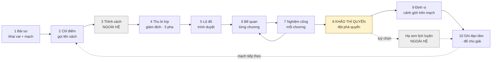

**Chặng 8 là tiêu chí đạt của cả hệ** (§1.3). Mọi chặng trước là đường dẫn tới nó.

**Hai chặng nằm ngoài hệ**, tô xám: *thỉnh sách* — người học tự đi kiếm PDF, không phần mềm nào làm hộ; và *hạ sơn lịch luyện* — mang ra dùng ở việc thật. Hạ sơn là **nhánh tuỳ chọn**, đường bằng chứng mạnh hơn cho ai có việc thật, không phải cửa bắt buộc.

**Thứ tự đổi so với bản trước:** định vị cảnh giới giờ nằm ở chặng 9, **sau** đột phá quyển — không phải chặng 3. Lý do ở §1.3: định vị chạy tự động ở mốc đột phá, và trước đó chưa đủ nguồn để R10 kết luận.

**Hai vòng lặp:** chương chưa đạt thì quay lại bế quan (7→6); xong một mạch thì quay lại chỉ điểm (10→2).

---

# 4 · TÁM VAI

## 4.1 Tám vai và đường truyền tin

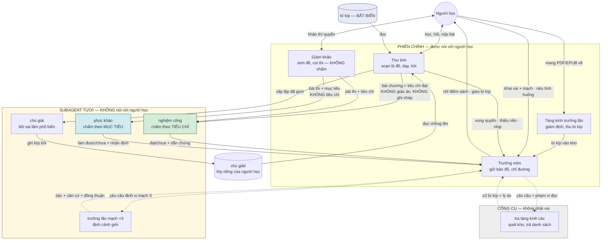

**Ba cạnh mang tải nặng nhất là ba cạnh nói rõ thứ KHÔNG mang theo:**

- `TL → NC` không mang giáo án và ghi chép — người dạy không được là người cấp chứng nhận
- `TL → PK` không mang tiêu chí — thấy tiêu chí thì phúc khảo chấm lại đúng thứ nghiệm công vừa chấm, trực giao mất
- `TM → TLAO` mang `pham_vi_doc` không chứa `thu-linh/**`

**Không có cạnh nào từ vùng subagent về thẳng người học.** Subagent thiếu dữ kiện thì trả `thieu_du_kien` kèm câu cần hỏi; vai cầm lượt hỏi hộ.

## 4.2 Ma trận quyền

Tám vai, cộng **đệ tử** — người học cũng là một chủ thể ghi, không phải chỉ là đối tượng.

| Hoạt động | Trưởng môn | Tàng kinh | Thư linh | Giám khảo | Trưởng lão mạch | nghiệm công | phúc khảo | chú giải | Đệ tử |
|---|:---:|:---:|:---:|:---:|:---:|:---:|:---:|:---:|:---:|
| Nói với người học | **Có** | **Có** | **Có** | **Có** | Cấm | Cấm | Cấm | Cấm | — |
| Chỉ điểm sách, xếp lớp nhiệm vụ | **Sở hữu** | Cấm | Cấm | — | — | — | — | — | — |
| Giám định và thu bí kíp vào kho | Cấm | **Sở hữu** | Cấm | — | — | — | — | — | — |
| Soạn lộ đồ và giáo án | Cấm | Cấm | **Sở hữu** | — | Cấm | — | — | — | — |
| Giảng · giải đáp · chẩn đoán · giảng lại | Cấm | Cấm | **Sở hữu** | **Cấm** | **Cấm** | Cấm | Cấm | Cấm | — |
| Sinh đề khảo thí, coi thi | Cấm | Cấm | **Cấm** | **Sở hữu** | — | — | — | — | — |
| Chấm theo `tieu_chi_dat` | Cấm | — | — | **Cấm** | — | **Sở hữu** | **Cấm** | — | — |
| Phán "làm được việc mục tiêu nói" | Cấm | — | Cấm | Cấm | — | Cấm | **Sở hữu** | — | — |
| Định cảnh giới trên một mạch | — | — | **Cấm** | — | **Sở hữu** | Cấm | Cấm | — | — |
| Xử bất đồng hai người soát | **Sở hữu** | — | **Cấm** | **Cấm** | — | — | — | — | — |
| Đọc giáo án và ghi chép dạy | — | — | Có | **Cấm** | **Cấm** | **Cấm** | **Cấm** | Cấm | — |
| Đọc `tieu_chi_dat` | Có | Có | Có | Có | **Cấm** | Có | **Cấm** | — | — |
| Đọc tình huống thật | Có | — | Có | Có | Cấm | Cấm | Cấm | **Cấm** | — |
| Ghi vào bí kíp gốc | Cấm | **Chỉ lúc thu** | Cấm | Cấm | Cấm | Cấm | Cấm | Cấm | Cấm |
| Ghi lớp chú giải | Cấm | Cấm | Cấm | Cấm | Cấm | Cấm | Cấm | **Sở hữu** | — |
| Ghi ứng viên bồi | Cấm | Cấm | **sai-lam** | Cấm | Cấm | **tieu-chi** | Cấm | Cấm | — |
| Ghi sổ đạo tâm | Cấm | Cấm | Cấm | Cấm | Cấm | Cấm | Cấm | Cấm | **Sở hữu** |
| Ép người học theo gợi ý | **Cấm** | **Cấm** | **Cấm** | **Cấm** | **Cấm** | — | — | — | — |

**Năm ô đáng chú ý:**

- **Giám khảo tách khỏi nghiệm công** — coi thi và chấm thi là hai người. Giám khảo sinh đề và giữ luật; nó **không được chấm**, nên không thể nới đề cho vừa bài.
- **Tàng kinh trưởng lão ghi bí kíp gốc chỉ lúc thu.** Sau đó bí kíp **bất biến**; mọi bồi đắp đi vào lớp chú giải.
- **Phúc khảo và trưởng lão cùng bị cấm đọc `tieu_chi_dat`** — cùng lý do, khác tầng: cho đọc thì cả hai trượt về đo lại thứ nghiệm công vừa đo.
- **Đệ tử sở hữu sổ đạo tâm.** Đây là lý do `dao-tam` tắt model-invocation: không vai nào được ghi hộ bằng chứng đo lường.
- **Chú giải cấm đọc tình huống thật** — vai duy nhất có đầu ra rời khỏi máy người học.

`tra-tang-kinh-cac` **không có trong bảng** — nó là công cụ quét kho của trưởng môn, không sở hữu quyết định nào.

## 4.4 Luồng dữ liệu và quyền ghi

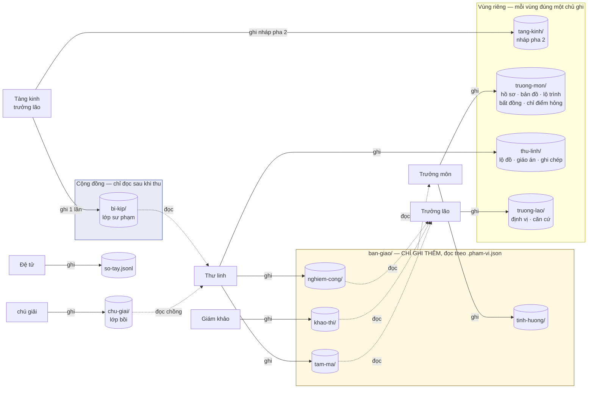

**Ba luật của sơ đồ này:**

1. **Mỗi vùng riêng đúng một mũi tên ghi.** Hai mũi tên ghi vào cùng một vùng là lỗi thiết kế, không phải chuyện tiện.
2. **`ban-giao/` chỉ ghi thêm.** Đổi trạng thái — kể cả `tam-ma` từ `chua_go` sang `da_go` — là **thêm một dòng mới**, không sửa dòng cũ. Trạng thái hiện tại là dòng gần nhất. Cùng nguyên tắc §5.7: trạng thái suy từ bản ghi, không lưu thành cờ sửa được.
3. **Không có file token cầm lượt.** Vai nào đang chạy trong phiên chính thì vai đó nói với người học; subagent không bao giờ nói. Một file mà hai vai cùng phải ghi để chuyền lượt là tự phá luật số 1.

## 4.5 Bốn ràng buộc không được vi phạm

1. **Thư linh chỉ biết một quyển.** Không được tuyên bố người học đạt một *mạch*. Đây là đặc tính nhân vật, không phải luật phải nhớ.
2. **Trưởng môn không dạy, không chấm.** Ẩn dụ kéo mạnh về hướng sai — phải cấm thẳng trong SKILL.md.
3. **Trưởng lão không thấy giáo án và ghi chép dạy.** Subagent **tươi**, không bao giờ fork.
4. **Chú giải ra ngoài không mang tình huống thật của người học.** Chặn bằng phạm vi đọc, không bằng lời dặn.

---

# 5 · QUY CÁCH DỮ LIỆU

## 5.0 Mô hình khái niệm

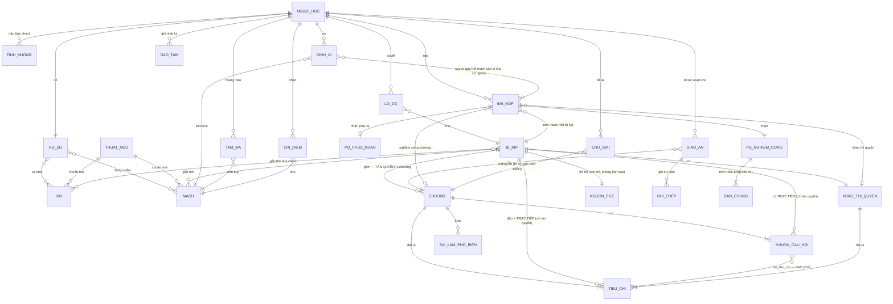

**Ba quan hệ mang tải nặng nhất:**

- **`KHUON_CAU_HOI }o--|{ TIEU_CHI`** — quan hệ bao phủ. Mỗi tiêu chí phải có ≥1 câu hỏi trỏ tới; đây là thứ §6.4 kiểm được bằng script chỉ vì liên kết này tường minh.
- **`DINH_VI }o--|{ BAI_NOP`** — nhiều-nhiều, và **đây là lý do trưởng lão tồn tại**. Nếu nó là 1–1 với một quyển thì vai đó thừa.
- **`BI_KIP ||--|| NGUON_FILE`** — con trỏ, không bản sao. Repo không chứa nội dung sách; §6.9 xử khi file dời chỗ.

**Ba chỗ đã chốt khi dựng mô hình này:**

| Chỗ | Chốt |
|---|---|
| Bài khảo thí quyển lưu ở đâu | **Hai thư mục tách hẳn**: `ban-giao/nghiem-cong/` và `ban-giao/khao-thi/` |
| Bí kíp nhiều mạch, bài nộp thuộc trục nào | **Mọi mạch bí kíp gắn thẻ.** Kéo theo: **bỏ `<mạch>` khỏi đường lưu** — một bài không nằm được ở hai thư mục. Mạch **suy ra từ thẻ của bí kíp lúc truy vấn** (§5.7), không mã hoá vào đường dẫn |
| Tàn quyển | **Không có chương.** `muc_tieu`, `gia_dinh_nen`, `tieu_chi_dat`, `khuon_cau_hoi`, `sai_lam_pho_bien` nằm **thẳng trên** tàn quyển. `kiem-bi-kip.py` vì vậy có **hai hình dạng kiểm** |

**Bên trái là dữ liệu của cộng đồng** (bí kíp, chương, tiêu chí — sinh ra ở pha 2, không đổi khi học). **Bên phải là dữ liệu của người học** (lộ đồ, giáo án, bài nộp, định vị, tâm ma, đạo tâm — sinh ra khi học). Ranh giới này khớp đúng ranh giới hai bề mặt ở §1.1.

## 5.1 Bí kíp — cấp quyển

```yaml
schema: 1
ten: "Kiểm thử dựa trên đặc tả"
nguon: { tieu_de: "...", tac_gia: "...", nam: 2015 }
loai: bi-kip            # bi-kip | tan-quyen
cau_truc: mang          # chuoi | mang — quyết cách sinh lộ đồ (§6.3)
nguon_file: { duong_dan: "…/babok-v3.pdf", van_tay: "sha256:…" }
canh_gioi_vao: luyen-khi
canh_gioi_ra: ket-dan
mach: [tu-duy, ky-thuat]
vai: [tester, ba]
xuong_song: [1, 2, 4, 7]
chi_nhanh: [3, 5, 6]
phu_thuoc: { 4: [2], 7: [4, 5] }
lop_nhiem_vu:
  - { chuong: [1, 2], do_phuc_tap: thap, gian_giao: day }
  - { chuong: [4, 7], do_phuc_tap: cao, gian_giao: mong }
ha_son_sau: [2, 7]
khao_thi_quyen:                    # THƯỚC của canh_gioi_ra — §1.3
  khuon: "Một {he_thong} có {quy_mo}, đang gặp {van_de}. Ngươi được giao {nhiem_vu}."
  bo_tham_so:                      # mỗi phần tử là MỘT BỘ đã khớp sẵn
    - {he_thong: "form đăng ký", quy_mo: "12 trường",
       van_de: "test case phình theo số trường", nhiem_vu: "rút gọn bộ test"}
    - {he_thong: "API thanh toán", quy_mo: "8 tham số",
       van_de: "lỗi lọt ở biên giá trị", nhiem_vu: "thiết kế lại ca kiểm"}
  du_thua:  ["một ràng buộc hiệu năng không liên quan"]
  tieu_chi_dat: [...]
```

**`du_thua` là tín hiệu phân biệt độc lập, không phải trang trí.** Nó đo một thứ mà `tieu_chi_dat` không đo: **khả năng chọn dữ kiện nào đáng dùng**, tách khỏi khả năng chọn đúng cách tiếp cận.

Quan sát từ mô phỏng: bài đọc lướt lấy dữ kiện thừa làm luận cứ (*"ngân sách đã duyệt nên triển khai được ngay"*); bài hiểu bỏ qua nó không nhắc. Hai bài khác nhau ở đó **trước cả** khi khác nhau ở tiêu chí.

**`bo_tham_so` chứ không phải danh sách rời.** Ba danh sách độc lập sinh ra tổ hợp vô nghĩa — *"có ảnh dây chuyền sản xuất, muốn phân khúc khách hàng"*. Người học nhận đề hỏng mà **không biết là đề hỏng hay mình dốt**, và đó là chế độ hỏng tệ nhất trong cả luồng khảo thí.

Mỗi phần tử `bo_tham_so` là một bộ đã khớp sẵn. **Ràng buộc biến mất chứ không được khai** — bộ không hợp lệ thì người thu không viết ra.

Đánh đổi: **số đề bằng số bộ**, công tuyến tính chứ không nhân lên. Chấp nhận được vì ở n=1 mỗi quyển thi một hai lần — số lượng đề là thứ rẻ nhất để hy sinh. Ba đường khác đều đắt hơn: khai cú pháp ràng buộc thì thêm một tầng vào quy cách và một chỗ nữa để hỏng; để giám khảo tự lọc lúc thi thì đẩy phán đoán về nội dung sách vào runtime, trong khi §6.4 đã tách rõ nó thuộc pha 2.

Mục đích của `khuon` vẫn như cũ: **đề không nhàm khi làm lại**, không phải chống nhờ AI khác — hệ tự nguyện, gian lận là tự hại.

`canh_gioi_vao` là **yêu cầu tu vi**, không phải thang giá trị. Bí kíp Luyện Khí không thấp kém — nó dành cho người ở Luyện Khí.

`xuong_song`/`chi_nhanh` cho phép cắt bớt; thiếu nó thì người có nghề bị bắt học lại và bỏ đi.
`ha_son_sau` đặt nhịp lịch luyện vào chính quyển sách.

## 5.2 Bí kíp — cấp chương

```yaml
chuong: 2
muc_tieu: "Chia được input thành phân vùng tương đương cho một form thật"
gia_dinh_nen: ["biết một test case gồm những gì"]
worked_example: { tro_toi: "chương 2, mục 2.3" }   # con trỏ vào sách gốc, không chép nội dung
sai_lam_pho_bien:
  - dau_hieu: "chia phân vùng theo trường trên màn hình"
    quan_niem_sai: "tưởng mỗi ô nhập là một phân vùng"
    cach_chua: "đưa một ô có 3 miền giá trị hợp lệ khác nhau"
khuon_cau_hoi:
  - { id: q1, loai: van_dung, bloom: ap_dung, do_tieu_chi: [tc1],
      khuon: "Trong {tinh_huong}, trường nào có nhiều hơn một miền hợp lệ?" }
  - { id: q2, loai: phan_tich, bloom: phan_tich, do_tieu_chi: [tc1],
      khuon: "Cách chia trong sách vướng gì ở {tinh_huong}?" }
tieu_chi_dat:
  - { id: tc1, mo_ta: "nêu được ≥1 phân vùng mà ranh giới không trùng ranh giới trường nhập" }
bai_luyen_lap: "..."
```

**Mọi trường bắt buộc.** Thiếu một trường → không vào tàng kinh các.

`do_tieu_chi` là trường **làm cho bao phủ kiểm được bằng script**: mỗi `tieu_chi_dat` phải có ≥1 câu hỏi trỏ tới nó. Không có liên kết tường minh thì việc "câu hỏi có phủ hết tiêu chí không" chỉ kiểm được bằng mắt, và sẽ không ai kiểm.

## 5.3 Ba loại câu hỏi

| Loại | Bloom | Tính là bằng chứng? |
|---|---|---|
| Tái hiện — "Ba nguyên tắc của X?" | Nhớ/Hiểu | Không |
| **Vận dụng** — "Trong tình huống này, chọn kỹ thuật nào và vì sao?" | Áp dụng | **Có** |
| **Phân tích** — "Cách trong sách vướng gì ở tình huống này?" | Phân tích | **Có** |

Sàn là **tầng Áp dụng**. Câu tái hiện không tính — nhớ lại không phải hiểu.

Trước đây có loại thứ tư là *va chạm* — hỏi chỗ thực tế không chạy như sách nói — nhằm phân biệt người **đã làm** với người **mới đọc**. Tiêu chí ở §1.3 chỉ đòi tới mức vận dụng, nên loại đó bị bỏ: nó đo thứ hệ không hứa, và làm việc soạn đề nặng lên vô ích.

## 5.4 Lộ đồ — cam kết với người học

```json
{ "schema": 1, "bi_kip": "kiem-thu-dac-ta", "duyet_luc": "2026-09-01T09:00+07:00",
  "chuong_hoc": [1,2,4,7], "chuong_bo": [3,5,6], "ly_do_bo": "đã có dấu hiệu ở hồ sơ",
  "gian_giao_khoi_diem": "day", "ha_son_tai": [2,7],
  "quy_mo": { "so_chuong": 4, "so_lan_ha_son": 2 } }
```

Giáo án là việc nội bộ của thư linh; **lộ đồ phải trình cho người học duyệt trước khi bắt đầu** — họ cần biết bao nhiêu chương và xuống núi mấy lần trước khi bỏ công vào.

Quy mô đo bằng **chương và lần hạ sơn**, không bằng giờ. Một chương có thể xong trong hai mươi phút hoặc kéo ba buổi tuỳ người và tuỳ tình huống họ mang vào — hứa số phút là hứa thứ không kiểm soát được.

## 5.5 Sổ đạo tâm — nhật ký con đường

**Không phải tiêu chí đạt** (§1.3 dùng khảo thí quyển). Sổ đạo tâm là nhật ký: thứ người học xem lại được, và là bằng chứng mang ra ngoài khi cần trình cho ai đó.

Vẫn giữ `kiem_chung` bắt buộc trỏ ra ngoài hệ — vì một nhật ký ghi cảm nhận thì vô dụng, còn ghi sự kiện có vết thì đọc lại sau sáu tháng vẫn tin được.

```json
{ "ngay": "2026-09-14", "viec": "tự viết được test plan cho module thanh toán",
  "truoc_day": "nhờ Tuấn ở QA làm hộ",
  "nho_gi": "bí kíp kiem-thu ch.2 — bảng phân vùng tương đương",
  "kiem_chung": "test plan đã dùng thật trong sprint 34" }
```

---

## 5.6 Catalog tàng kinh các

Catalog **không khai trong repo** — nó **sinh ra từ quét kho riêng** `~/.vandao/bi-kip/`, nên là loại 3 (§5.9): xoá đi dựng lại được. Dạng sau khi sinh:

```
bi_kip,ten,mach,vai,canh_gioi_vao,phu_thuoc,required,duong_dan,nghiem_cong
_meta,,,,,,false,tai-lieu/van-dao.md,
kiem-thu-dac-ta,Kiểm thử dựa trên đặc tả,tu-duy|ky-thuat,tester|ba,luyen-khi,,false,bi-kip/kiem-thu-dac-ta,nghiem-cong/*/kiem-thu-dac-ta/*
```

Ba cơ chế:

- **`phu_thuoc` là gợi ý mềm; `required` là cổng cứng.** Trưởng môn nêu thứ tự nên đi, chỉ chặn ở dòng `required=true`. Đây là chỗ nguyên tắc "gợi ý, không ép" (R7) có mô hình dữ liệu chứ không chỉ có lời.
- **Dòng `_meta`** mang đường dẫn tài liệu Vấn Đạo. Câu hỏi không khớp bí kíp nào thì đọc chỗ đó trả lời, không bịa.
- **`nghiem_cong` là mẫu đường dẫn để suy trạng thái** — xem 5.7.

## 5.7 Trạng thái suy từ artifact, không từ file trạng thái

`ban-do.json` là **cache, dựng lại được**. Nguồn sự thật là những gì có thật trên đĩa: quét `~/.vandao/ban-giao/nghiem-cong/**` rồi khớp ngược về dòng catalog qua mẫu `nghiem_cong`.

Lý do: file trạng thái phải giữ đồng bộ, mà mọi thứ phải giữ đồng bộ đều lệch. Bài nghiệm công thì tồn tại hoặc không — không có trạng thái thứ ba. Xoá `ban-do.json` bất cứ lúc nào, `ban-do.py` dựng lại được nguyên.

## 5.8 Quy ước tiền tố

Mọi trường nhận danh sách dùng chung ba dạng mục:

| Dạng | Nghĩa |
|---|---|
| `file:<đường dẫn hoặc glob>` | Nạp nội dung file làm dữ kiện |
| `skill:<tên>` | Gọi skill đó |
| văn bản trần | Dùng nguyên câu đó làm chỉ thị |

Áp cho `persistent_facts`, `doc_standards`, `nghiem_cong_reviewers`, `tieu_chi_dat` khi trỏ ra ngoài. Một quy ước, mọi chỗ.

## 5.9 Phân định: lưu trữ hay sinh tại chỗ

Nguyên tắc: **cái gì phải giống nhau ở hai lần chạy thì lưu; cái gì được phép khác nhau thì để LLM sinh.**

Không phải "quan trọng thì lưu". Bài giảng hay cũng quan trọng, nhưng khác nhau mỗi lần là điều tốt.

### Ba loại

**Loại 1 — Phán quyết và cam kết. Lưu nguyên văn.**

`tieu_chi_dat` · lộ đồ đã duyệt · bài nghiệm công người học nộp · `dinh-vi` và căn cứ · dòng đạo tâm · `phu_thuoc`, `xuong_song`.

Đặc điểm chung: **có người dựa vào đó để quyết**, hoặc **có cái sau đối chiếu ngược lại**. Nghiêm nhất là `tieu_chi_dat` — nó là thước đo, mà thước co giãn theo lượt thì mọi phép đo phía trên đều rỗng.

**Loại 2 — Diễn giải. Sinh tại chỗ, KHÔNG lưu.**

Lời giảng · cách trình bày một ý · ví dụ minh hoạ · câu hỏi dẫn dắt · cách diễn đạt phản hồi.

Lưu chúng là **có hại**, không chỉ thừa: khoá thư linh vào cách giảng cũ và phá F5 (giảng lại bằng biểu diễn khác).

**Loại 3 — Dẫn xuất. Cache, luôn dựng lại được.**

`ban-do.json` · hai khung nhìn tàng kinh các · bậc cảnh giới hiện tại.

Luật: **xoá đi phải dựng lại y nguyên.** Không dựng lại được nghĩa là nó thuộc loại 1 và đang bị xếp nhầm.

### Giáo án tách làm hai

Giáo án chứa cả hai loại. Luật 2 ở §7.1 ghi *kết quả* mỗi nước đi — nhưng **ghi sự kiện, không ghi nội dung**:

```json
{ "buoc": 3, "cach": "vi-du-A", "ket_qua": "van_vap" }
{ "buoc": 4, "cach": "mo-hinh-B", "ket_qua": "thong" }
```

Đủ để F5 biết đừng lặp lại cách A, mà không kéo cả đoạn giảng vào ngữ cảnh lần sau. `ghi-chep/` vì vậy co lại chỉ còn **sự kiện**, không còn transcript.

### Ba luật chống context rot

1. **Cái gì nạp mỗi phiên phải có chặn trên về kích thước.** `SessionStart` nạp `ho-so` + `ban-do` + lộ đồ đang dở — cả ba **cố định cỡ**: hồ sơ không dài ra theo số bí kíp đã học, bản đồ là snapshot không phải nhật ký. `lo-trinh.jsonl` và `can-cu/*.jsonl` **không bao giờ nạp toàn bộ**.

2. **Cái gì lớn theo thời gian phải nằm sau một truy vấn có lọc.** Bài nghiệm công tích luỹ vô hạn; trưởng lão nhận `pham_vi_doc` đã lọc theo mạch. Chi phí phải tỉ lệ với **thứ cần**, không với **thứ có**.

3. **Cái gì chỉ dùng một lần phải nằm trong subagent.** Đọc catalog để chọn ba bí kíp, đọc mười bài nghiệm công để định vị — kết quả cần một dòng, quá trình cần vài chục nghìn token. Đây là toàn bộ lý do `tra-tang-kinh-cac` và `truong-lao` là subagent chứ không phải bước trong skill.

### Phép kiểm cho mỗi trường mới

1. Có ai đối chiếu ngược lại nó không? → có: **lưu nguyên văn**
2. Lần sau sinh khác đi thì có ai thiệt không? → có: **lưu**
3. Nó lớn lên theo thời gian không? → có: **lưu ngoài ngữ cảnh**, chỉ đọc qua truy vấn có lọc

Ba câu "không" hết → để LLM sinh tại chỗ, và đừng lưu.

## 5.10 Thư giữa các vai — trần chưng cất

Subagent có thể **đọc hàng chục nghìn token** nhưng chỉ được **trả về một bản chưng cất cỡ một tới hai nghìn token**. Đó là toàn bộ lý do nó tồn tại: quá trình khám phá ở lại bên trong, chỉ kết luận đi ra.

### Trần đặt bằng cấu trúc, không bằng lời

Bảo model "đừng dài quá 2.000 token" là luật yếu — model không đếm được token của chính mình một cách đáng tin. Trần vì vậy biểu diễn bằng **ràng buộc lược đồ**, và `kiem-thu.py` kiểm được.

**Con số dẫn ra thế nào.** Đo trên chính văn xuôi tiếng Việt của tài liệu này: **5,3 ký tự một âm tiết**. Fertility của tokenizer với ngôn ngữ không thuộc nhóm Latin phổ biến rơi vào khoảng **2–2,5 token một âm tiết** — nghĩa là tiếng Việt tốn gấp 2–3 lần tiếng Anh cho cùng lượng nghĩa. Ghép lại: **1 token ≈ 2,1–2,7 ký tự**, tức một trường 300 ký tự ≈ 110–140 token.

Ngân sách cả thư nhắm **1.000–2.000 token**, chừa ~15% cho khung JSON và tên trường.

| Subagent | Trường | Trần | ≈ token |
|---|---|---|---|
| `truong-lao` | `bac` (enum 5, **hoặc `null`**) · `dong_thuan` · `do_tin` | — | ~20 |
| | `can_cu[]` | ≤5 đường dẫn | ~80 |
| | `dau_hieu[]` — **không chứa nhãn bậc** | ≤4 mục, mỗi mục ≤200 ký tự | ~300 |
| | `thieu` (văn xuôi) | ≤400 ký tự | ~150–190 |
| | `nhan_dinh` (văn xuôi, **được nhắc bậc**) | ≤600 ký tự | ~220–290 |
| `tra-tang-kinh-cac` | `de_xuat[]` | ≤3 mục, `ly_do` ≤300 ký tự | ~400 |
| `nghiem-cong` | `theo_tieu_chi[]` | **không giới hạn số mục** — một mục cho mỗi `tieu_chi_dat` | tuỳ chương |
| | mỗi mục: `dan_chung` | ≤400 ký tự | ~170/mục |
| | `nhan_dinh` (văn xuôi, cả bài) | ≤600 ký tự | ~220–290 |
| `chu-giai` | `issue[]` | ≤5 mục, `dang_vap` ≤300 ký tự | ~600 |

**Mỗi thư được đúng một trường văn xuôi**, đặt tên `nhan_dinh`, có trần ký tự. Đây là chỗ subagent nói được thứ dữ liệu có cấu trúc không diễn đạt nổi — *"gần đúng nhưng nhầm ở ranh giới"*. Hai trường văn xuôi trở lên thì trần vỡ và thiên kiến của subagent rò sang ngữ cảnh vai gọi.

**Thư `nghiem-cong` dài theo số tiêu chí của chương, và đó là đúng.** Chương tám tiêu chí thì cần tám phán quyết; ép chọn "tiêu chí quan trọng" là để thư linh tự bỏ tiêu chí, phá đúng thứ §5.9 gọi là thước đo. Chương nào làm thư phình quá thì vấn đề nằm ở **chương có quá nhiều tiêu chí**, sửa trong bí kíp, không sửa ở thư.

**Mấy con số trên là suy ra, chưa đo trên thư thật.** Sau vài chục lượt nghiệm công, đo phân bố độ dài thật rồi chỉnh — nới nếu bị cắt oan thường xuyên, siết nếu chưa bao giờ chạm trần.

### Vượt trần thì chưng cất lại, không cắt cụt

`kiem-thu.sh` (hook `SubagentStop`) chạy `kiem-thu.py`. Vượt trần → **trả về cho subagent chưng cất lại một lần**, kèm chính thông báo lỗi làm ngữ cảnh. Vẫn vượt → thư vào với cờ `qua_tran: true` và vai gọi biết là bản này chưa gọn.

Không bao giờ **cắt cụt**: cắt giữa chừng mất phần kết luận, mà kết luận thường nằm cuối.

### Khi hệ từ chối công bố bậc, được nói gì

R10 trả `bac: null` khi chưa đủ nguồn hoặc k lần tản mát. Câu hỏi: vai cầm lượt nói gì với người học?

**Ranh giới: từ chối công bố NHÃN, không cấm nói DẤU HIỆU.**

| | Cần gì để đúng | Hệ có chưa |
|---|---|---|
| *"Ngươi ở Trúc Cơ"* — **nhãn** | Đủ nguồn + đồng thuận | Chưa |
| *"Ngươi tự nêu được ranh giới khi mất nhãn"* — **dấu hiệu** | Đã quan sát thấy trong bài | **Rồi** |

Nên khi `bac: null`, vai cầm lượt dựng câu từ **`thieu` + `dau_hieu[]`**, không dùng `nhan_dinh`:

> *"Chưa đủ để định cảnh giới — mới một quyển trên mạch này. Điều thấy được: ngươi tự nêu được ranh giới 'nếu không có nhãn thì chỉ gom cụm được'. Cần thêm một quyển nữa để biết đó là hiểu thật hay trúng một lần."*

**`dau_hieu[]` tách khỏi `nhan_dinh` chính vì việc này.** `nhan_dinh` là văn xuôi tự do và **được phép nhắc bậc** — nó dành cho trưởng môn và sổ hiệu chuẩn. `dau_hieu[]` **cấm chứa nhãn bậc**, nên vai cầm lượt bóc bằng cách **chọn trường**, không phải biên tập câu. Bóc bằng biên tập là chỗ chữ *"Trúc Cơ"* lọt ra.

Cùng nguyên tắc với luật cấm khen ở §7: **mô tả thứ quan sát được, đừng gán nhãn.** Và nó tránh một chế độ hỏng: nếu chỉ được nói khi có nhãn, thì nhãn thành thứ duy nhất người học nghe — mà nhãn lại là thứ dễ sai nhất.

### Phản hồi cho người học không đến từ subagent

`nghiem-cong` trả dữ liệu; **thư linh** đọc dữ liệu đó rồi mới nói với người học bằng ngôn ngữ người. Đây là lý do trần cấu trúc không làm phản hồi khô đi — phần diễn giải thuộc loại 2 (§5.9), sinh tại chỗ, không đi qua thư.

## 5.11 Nén phiên bế quan

Một chương chạy hàng chục lượt. Context rot là **dốc, không phải vách** — chất lượng đã kém đi từ lâu trước khi cửa sổ đầy, nên "còn chỗ" không phải "an toàn".

### Vì sao nén ở đây nhẹ hơn ca chung

Compaction thông thường phải **tóm tắt** hội thoại, vì agent chỉ giữ trạng thái trong ngữ cảnh. §5.9 đã đẩy gần hết ra file, nên chỉ một phần nhỏ thật sự cần cứu:

| Tích luỹ trong phiên | Đã ở file? |
|---|---|
| Lộ đồ · giáo án · tình huống · bài nghiệm công · sự kiện vấp | **Có** |
| Đang dạy tới ý nào, câu hỏi nào treo | Không |
| Cách người học diễn đạt chỗ hiểu nhầm · ràng buộc bối cảnh họ buột miệng nói | Không — loại 2 |

Nên nén là **tái dựng + chưng phần dư**, không phải tóm tắt. Hai thứ này cứu hai tập **rời nhau**: tái dựng cứu thứ có trong file (xác định, kiểm được), chưng cứu thứ chỉ có trong hội thoại. Chọn một trong hai là bỏ sót một tập.

### Hai bước: xả trước, chưng sau

**Bước 1 — Xả.** Mọi thứ loại 1 còn kẹt trong ngữ cảnh ghi ra file: cam kết người học vừa nói → `tinh-huong/` · kết quả nước đi → `ghi-chep/*.jsonl` · điểm neo.

Bước này quan trọng vì có thứ dễ tưởng là dư mà thực ra là loại 1: câu *"tôi sẽ thử trên module thanh toán"* là **cam kết**, phải lưu, không được tóm tắt.

**Bước 2 — Chưng.** Chỉ phần dư loại 2, và có cấu trúc như mọi thứ khác:

```json
{ "y_hien_tai": 3, "tong_so_y": 5, "cau_hoi_dang_treo": "…",
  "cach_da_dung": ["vi-du-A", "mo-hinh-B"],
  "du": { "cach_dien_dat_hieu_nham": "≤300 ký tự",
          "rang_buoc_boi_canh": ["≤3 mục"] } }
```

Trần `du` ≈600 ký tự, tương đương `nhan_dinh` ở §5.10. Không có ô văn xuôi tự do — cho ô tự do thì model trôi về kể lại bài học.

### Ghi neo mỗi ý, reset chỉ khi hết chương

Hai việc khác nhau, đừng gộp:

| | Khi nào | Tốn gì |
|---|---|---|
| **Ghi điểm neo** | Sau **mỗi ý đã chốt** | Một lần ghi file, rẻ |
| **Reset ngữ cảnh** | **Chỉ khi hết chương** | Mất mạch trò chuyện |

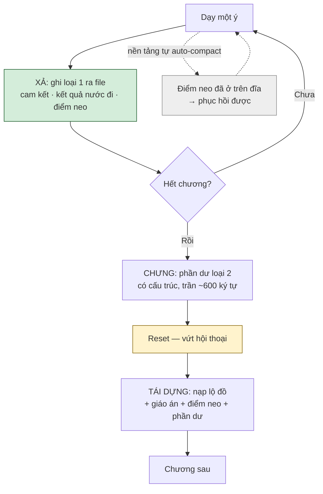

**Vì sao reset ở hết chương chứ không ở ngưỡng token:** hết chương là **ranh giới ngữ nghĩa** — thứ cần mang sang chương sau đã ra file hết rồi. Reset giữa chừng thì cắt ngang lúc người học đang có đà, mà thứ cứu được cũng không nhiều hơn.

**Rủi ro đã chấp nhận:** chương rất dài — nhiều ý, vài lần vấp, F5 hai lượt — sẽ chạy tới cuối mà không nén, và chất lượng kém dần theo dốc context rot. **Claude Code có thể tự auto-compact** trước khi tới cuối chương, bằng tóm tắt chứ không bằng tái dựng — tức đúng kiểu lossy mà mục này dựng lên để tránh.

Chỗ đỡ: **điểm neo ghi mỗi ý nên đã nằm trên đĩa**. Nền tảng có nén thì thư linh đọc lại neo và tiếp đúng chỗ. Đây là lý do giữ nhịp ghi mỗi ý kể cả khi không reset mỗi ý.

**Thư linh tự thực hiện**, không qua hook. Với ranh giới cố định là hết chương thì gần như không còn gì để quyết — nó chỉ cần làm đúng thứ tự xả → chưng → reset.

### Khi lệch thì file thắng

Model không nhìn thấy file lúc đang chưng, nên phần dư **sẽ** thỉnh thoảng trùng với thứ đã có trong file. Luật *"cấm trùng"* đúng nhưng không tuân được.

Thay bằng luật một dòng, kiểm được: **lệch nhau thì file thắng.** Đơn giản hơn dựng script đối chiếu, và giữ đúng nguyên tắc một nguồn sự thật ở §5.7.

### Nén im lặng

Thư linh **không thông báo** đã nén. Chỉ nói khi người học hỏi lại thứ đã mất — *"chỗ đó ta không còn giữ, ngươi nhắc lại giúp"*.

Ba lý do, xếp theo trọng lượng:

1. **Tránh tạo điểm rời.** Với hệ tự nguyện, bỏ cuộc là rủi ro số một. Một câu *"đang ở ý 3/5"* vừa động viên vừa là chỗ dừng hợp lý để đóng máy. Không có vạch thì người học ở trong mạch.
2. **Giữ nhân vật.** Thông báo phơi ra rằng sau thư linh có ngữ cảnh, có nén, có giới hạn.
3. **Không cắt đà.** Ý vừa chốt là lúc người học đang chạy; chèn một nhịp hành chính vào đó là phí.

**Cái giá đã chấp nhận:** nếu điểm neo ghi sai — ví dụ đánh dấu ý 2 đã thông trong khi người học chưa — thì cái sai đi tiếp vài ý mới lộ. Thông báo mỗi ý sẽ bắt sớm hơn, nhưng bốn lần cắt mạch mỗi chương là giá đắt hơn.

## 5.12 Tâm ma

**Tâm ma là cách làm cũ người học mang sẵn vào, đủ ăn sâu để bẻ cong mọi thứ dạy sau đó.**

Khác `sai_lam_pho_bien` ở nguồn gốc: `sai_lam_pho_bien` là lỗi phát sinh **trong** chương, khai sẵn trong bí kíp, chung cho mọi người học. Tâm ma là thứ **nhập từ ngoài vào**, riêng từng người, và bí kíp không thể biết trước.

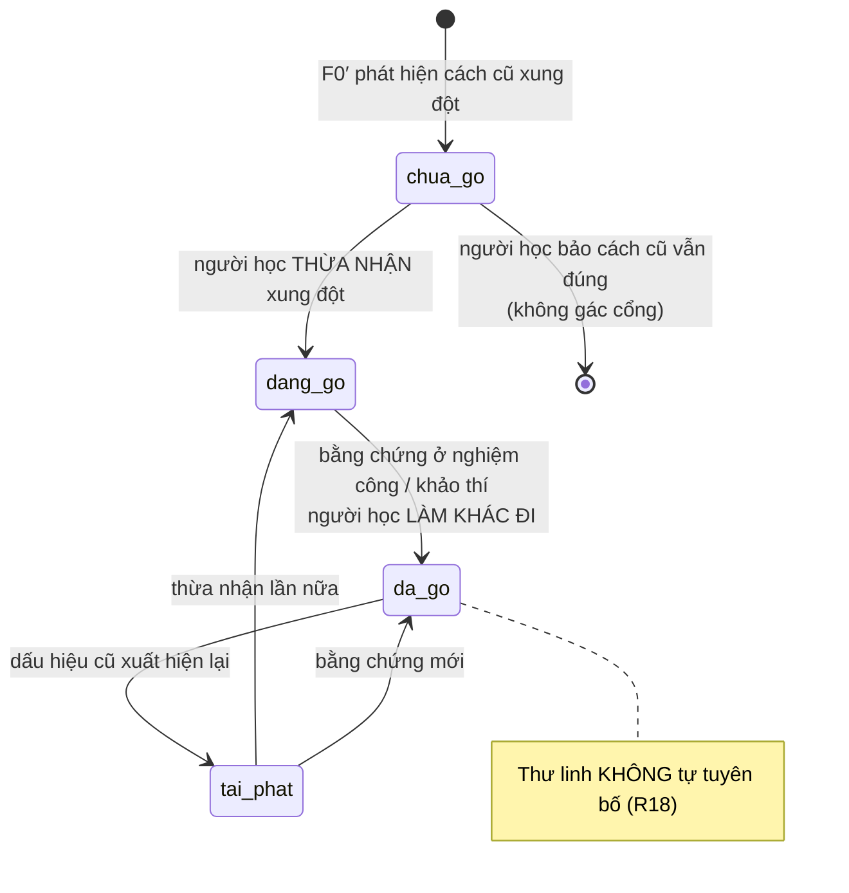

**Bốn trạng thái, chuyển bằng hai loại tín hiệu khác nhau:**

| Chuyển | Cần gì |
|---|---|
| `chua_go` → `dang_go` | **Lời của người học** — họ thừa nhận cách cũ vướng |
| `dang_go` → `da_go` | **Bằng chứng trong bài** — làm khác đi thật, không phải nói khác đi |
| `da_go` → `tai_phat` | Dấu hiệu cũ xuất hiện lại |

Ranh giới giữa hai loại tín hiệu là chỗ dễ trượt nhất: **thừa nhận không phải gỡ**. Người học nói *"à đúng, tôi hay làm theo template"* là bước một, không phải bước cuối. Trộn hai cái thì mọi tâm ma đều được gỡ ngay trong lượt phát hiện ra nó.

**`tai_phat` giữ riêng, không quay về `chua_go`** — tái phát khác lần đầu ở chỗ người học **đã từng gỡ được**. Thư linh nói với người tái phát khác với người mới: *"chỗ này ngươi từng vượt qua ở chương 3"*. Gộp về `chua_go` là vứt thông tin đó.

**Nhánh thoát ở `chua_go`:** người học bảo cách cũ vẫn đúng trong hoàn cảnh của họ thì **đóng, không ép**. §7.2 đã nói nêu xung đột chứ không phán ai đúng — nhánh này là chỗ luật đó có hiệu lực thật.

```json
{ "schema": 1, "mach": ["ky-thuat", "tu-duy"],
  "phat_hien_tai": "kiem-thu-dac-ta/ch2",
  "cach_cu": "chia test case theo trường trên màn hình",
  "vi_sao_dinh": "5 năm làm theo template của team",
  "xung_dot_voi": "chia theo miền giá trị",
  "trang_thai": "chua_go", "luc": "…" }
```

`trang_thai`: `chua_go` · `dang_go` · `da_go` · `tai_phat`.

**`mach` là mảng** — tâm ma phát hiện khi học một bí kíp thì gắn **mọi mạch bí kíp đó khai thẻ**, cùng luật với bài nộp (§5.0). Một cách làm cũ hiếm khi chỉ vướng đúng một trục.

**Chỉ ghi thêm.** Đổi trạng thái là **thêm một dòng mới**, không sửa dòng cũ; trạng thái hiện tại là dòng gần nhất. Nhờ vậy lịch sử còn nguyên: gỡ lúc nào, ở bí kíp nào, tái phát sau bao lâu.

Lưu ở `ban-giao/tam-ma/<mạch>.jsonl` — thư linh ghi, nhưng **vùng chia sẻ** vì tâm ma theo người chứ không theo quyển: phát hiện ở bí kíp này thì bí kíp sau phải biết. Trưởng lão đọc được, và đó là chủ ý — bám quy tắc cũ cứng nhắc là **dấu hiệu cảnh giới** rõ hơn nhiều thứ khác.

**Chú giải ghi vào lớp riêng, không sửa bí kíp gốc.** `~/.vandao/chu-giai/<bí kíp>/<chương>.md` — thư linh đọc bí kíp rồi đọc chồng lớp này lên ở F0 và F4. Bí kíp **bất biến sau khi thu**, nên không cần ai duyệt việc ghi, và gỡ lớp bồi ra lúc nào cũng quay về bản gốc. Đúng nghĩa chú giải đời sau: lời chú bên lề, không phải chép lại sách.

**Chuyển sang `da_go` chỉ bằng bằng chứng** ở nghiệm công hoặc khảo thí — người học tự làm khác đi. Thư linh **không được tự tuyên bố** đã gỡ.

# 6 · THU BÍ KÍP

Không phải soạn thảo. Đầu vào là **PDF/EPUB người học đã có**; đầu ra là lớp sư phạm trong kho riêng. Bí kíp lưu **con trỏ tới file**, không lưu bản sao.

## 6.1 Giám định — trước khi phân giải

| Kiểm | Hỏng thì |
|---|---|
| Rút được chữ không | *"Bản này không rút được chữ, tìm bản khác"* — **dừng**. Không OCR |
| Mục lục lấy được không | Báo, vẫn đi tiếp, pha 2 người tự xếp |
| Cấu trúc **chuỗi** hay **mạng** | Quyết cách sinh lộ đồ — xem 6.3 |
| Bao nhiêu chương · ước chi phí | Trình rồi chờ duyệt |

Giám định tồn tại để hỏng thì **báo ngay**, không để đệ tử đợi mười phút rồi nhận một bí kíp rỗng và tưởng plugin hỏng.

**Rút không được chữ thì báo về trưởng môn qua hộp thư.** Tàng kinh trưởng lão không ghi được `chi-diem.jsonl` — đó là vùng của trưởng môn. Nó gửi một thư:

```json
{ "schema": 1, "tu": "tang-kinh", "toi": "truong-mon",
  "hoi": "bao_ban_hong", "bi_kip_chi_diem": "software-requirements",
  "ly_do": "672 trang, không font, 5 trang đầu rút ra 0 ký tự — bản chụp ảnh",
  "trang_thai": "cho" }
```

Trưởng môn nhận và đổi trạng thái chỉ điểm sang `ban_hong` (§10.4). **Không** ghi vào `chi-diem-hong.jsonl` — sách vẫn đúng.

Hộp thư dùng được cho việc này mà không cần cơ chế mới: nó vốn là chỗ **mọi vai gửi, mọi vai đọc** (§15.1), không riêng cho subagent.

Hai adapter — PDF và EPUB — **một lược đồ ra**. EPUB rẻ hơn hẳn: HTML có cấu trúc, mục lục sẵn.

## 6.2 Ba pha, người chen vào pha 2

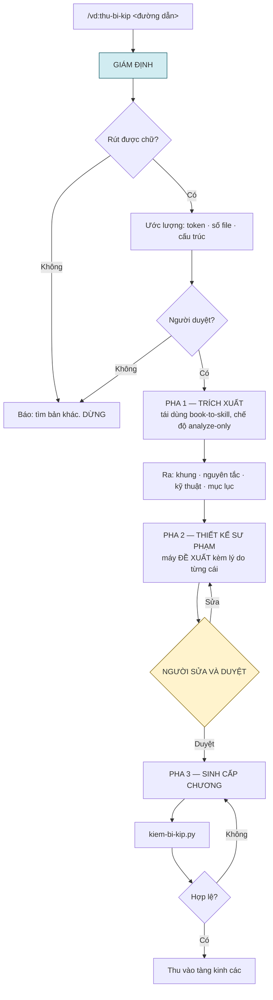

**Người bắt buộc chen vào pha 2.** Xương sống, tiêu chí đạt và điểm hạ sơn chỉ người có nghề quyết được; model đoán ra thứ nghe hợp lý mà sai, và cái sai truyền xuống mọi chương.

**Kỹ thuật xử sách lớn:** `grep`/`sed` lấy lát cắt thay vì đọc cả file. Sách 200 trang ≈ 75k token; đọc lại một lần cho mỗi chương qua 28 lượt tốn ~2 triệu token đầu vào.

**Cấm nhồi:** chương không có gì để mở rộng thì để dưới sàn ngân sách, không phồng cho đủ số.

## 6.3 Chuỗi hay mạng — hai cách sinh lộ đồ

Không phải *"sách này học được hay không"*, mà là **lộ đồ dựng theo cách nào**.

| `cau_truc` | Ví dụ | Lộ đồ sinh từ |
|---|---|---|
| `chuoi` | Giáo trình có chương nối tiếp | **Thứ tự chương** |
| `mang` | BABOK, sách tra cứu — cùng một kỹ thuật xuất hiện ở nhiều vùng với vai trò khác nhau | **Độ phức tạp tình huống áp dụng** |

Sách cấu trúc mạng **không nghèo cấu trúc hơn** — nó giàu hơn theo chiều khác: đọc sâu là thấy vì sao cùng một kỹ thuật đổi vai trò khi bối cảnh đổi.

Với `mang`, `lop_nhiem_vu` lấy từ nhiệm vụ chứ không từ sách: cùng một kỹ thuật, ca đơn giản trước, ca có xung đột stakeholder sau. Đây đúng 4C/ID — **xương sống là learning task, sách chỉ là supportive information**.

Giám định báo: *"bản này cấu trúc mạng — lộ đồ dựng theo nhiệm vụ, ngươi cần nêu vài tình huống thật để ta xếp"*. Là **yêu cầu thêm đầu vào**, không phải chê sách.

## 6.4 Cổng nhất quán chéo

`kiem-bi-kip.py` hiện kiểm **từng trường có đủ không**. Cổng này kiểm **các trường có nói cùng một chuyện không** — một bí kíp có thể hợp lệ hoàn toàn mà bốn trường nói bốn chuyện khác nhau.

**Kiểm tất định — script làm, chạy trong `kiem-bi-kip.py`:**

| Kiểm | Hỏng nghĩa là |
|---|---|
| Mỗi `tieu_chi_dat` có ≥1 câu hỏi trỏ tới qua `do_tieu_chi` | Có tiêu chí không câu nào lộ ra được |
| Mọi `do_tieu_chi` trỏ tới id có thật | Liên kết chết |
| Mỗi chương xương sống có ≥1 câu ở tầng Áp dụng trở lên | Chương chỉ đo tầng Nhớ |
| `gia_dinh_nen` của chương đầu không vượt `canh_gioi_vao` của quyển | Quyển tự mâu thuẫn ở cửa vào |
| `lop_nhiem_vu` phủ hết chương, độ phức tạp không giảm ngược | Giàn giáo xếp sai chiều |

**Kiểm cần phán đoán — model làm, cuối pha 3, người duyệt:**

| Câu hỏi | Vì sao script không làm được |
|---|---|
| `tieu_chi_dat` có đo đúng `muc_tieu` không? | So sánh ngữ nghĩa |
| `worked_example` có minh hoạ đúng `muc_tieu` không? | Như trên |
| `cach_chua` có dựa vào thứ chương này dạy không? | Cần đọc nội dung |
| **Hợp các `tieu_chi_dat` của chương xương sống có đủ để qua `khao_thi_quyen` không?** | Câu quan trọng nhất |

Dòng cuối là chỗ bí kíp gãy âm thầm nhất: khảo thí quyển đòi một thứ mà **không chương nào dạy**. Người học học đủ, thi trượt, và không ai biết vì sao. Hỏng ở đây không chặn — nó **báo và bắt người duyệt xác nhận**, vì có thể quyển đó cố ý đòi tổng hợp vượt tổng các phần.

## 6.5 Hai mức hợp lệ — thu rồi bồi dần

### Vì sao cần

Pha 2 đòi người thu khai `tieu_chi_dat` và `sai_lam_pho_bien` — **cho một quyển họ thu về để học**. Nếu đã biết chỗ người ta hay hiểu nhầm thì đâu cần học nó.

Với quyển mỏng đọc hết trong một lượt thì làm được. Với quyển 400 trang chưa đọc thì **không ai đủ tư cách thiết kế sư phạm trước khi đọc** — kể cả model.

Chuẩn không hạ. **Thời điểm đạt chuẩn hoãn lại.**

### Hai mức

| | **Đủ dùng** — vào kho, học được | **Đủ chuẩn** — chia sẻ được |
|---|---|---|
| Chương **xương sống** | `muc_tieu` · `gia_dinh_nen` · `tieu_chi_dat` thô · ≥1 câu `van_dung` | thêm `tieu_chi_dat` chi tiết · `sai_lam_pho_bien` · `worked_example` |
| Chương **chi nhánh** | `muc_tieu` | phần còn lại, **hoặc không bao giờ** |
| Cấp quyển | đủ mọi trường ở §5.1 | như trên |

Chi phí pha 2 vì vậy tỉ lệ với **số chương xương sống**, không với tổng chương. Quyển 20 chương mà xương sống 6 thì công giảm hai phần ba.

### Bồi lúc nào

**Sau khi học chương đó**, không phải theo lịch. Đó là lúc người thu vừa vấp, vừa biết chỗ người ta hay sai — và cũng là lúc lời khai đáng tin nhất.

Thư linh dạy chương mức *đủ dùng* phải **nói rõ**: *"chương này chưa có tiêu chí chi tiết, ta chấm theo mục tiêu thôi."* Không nói thì người học tưởng đang được chấm chặt hơn thực tế.

### Chỗ hai mức KHÔNG cứu được

Ở n=1, người học **luôn là người đầu tiên** — luôn dùng bản chưa bồi. Lớp bồi họ tạo ra chỉ có ích cho **lần học lại** hoặc **người khác**.

Đây là hạn chế cấu trúc, không phải thiếu sót cài đặt. Ghi lại để không ai tưởng bồi dần giải được nó.

## 6.6 Vòng đời một bí kíp

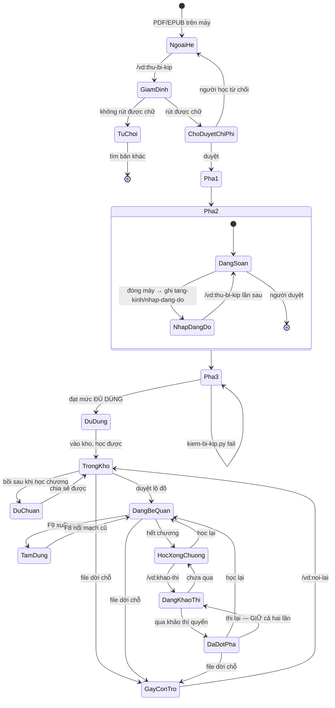

**Bốn điều máy trạng thái này chốt:**

| | |
|---|---|
| **Nháp pha 2 lưu được** | Thiết kế sư phạm mất nhiều lượt; đóng máy giữa chừng mà mất nháp thì lần sau người ta bỏ luôn việc thu sách. Nháp ở `tang-kinh/nhap-dang-do/<id>.json` — vùng riêng của Tàng kinh trưởng lão. `thu-bi-kip` gọi lại vào thẳng pha 2, không chạy lại pha 1 |
| **Xuất quan là tạm dừng** | F9 ghi lý do bỏ; F8 đưa quay lại. Hai luồng này giờ nối vào nhau — trước đó chúng rời nhau trong đặc tả |
| **Đột phá không phải trạng thái cuối** | Học lại được, thi lại được, và **giữ cả hai lần** |
| **Gãy con trỏ vắt ngang** | Xảy ra ở bất cứ trạng thái nào sau khi thu; `/vd:noi-lai` đưa về đúng chỗ cũ, lớp sư phạm không phải dựng lại |

**Vì sao giữ cả hai lần thi thay vì ghi đè:** mỗi lần khảo thí là một mẫu cho `bat-dong.jsonl` và cho sổ hiệu chuẩn §11. Ghi đè là vứt dữ liệu — mà dữ liệu chấm ở n=1 vốn đã hiếm. Bản đồ hiển thị **lần gần nhất**; sổ giữ **tất cả**.

## 6.7 `sai_lam_pho_bien` — nguồn phải gắn cờ

Trường mang nhiều giá trị sư phạm nhất, và sách hiếm khi viết ra. Ba nguồn, xếp theo độ tin:

| Nguồn | Cờ |
|---|---|
| **Người học tự nói sau khi vấp** — F4 hỏi *"ngươi nghĩ vì sao mình hiểu theo hướng đó?"* | `nguoi` — **chất lượng cao nhất** |
| **Người thu nhập ở pha 2** — có nghề, biết chỗ người ta hay sai | `nguoi` |
| **Sách tự nói** — chương có mục cạm bẫy, hoặc chỗ nó phân biệt hai khái niệm gần nhau | `sach` |
| **Model suy đoán** | `suy_doan` — phải hiện cờ khi dùng |

Trường này **bắt đầu rỗng cũng không sao** — nó tự đầy lên qua chú giải (§5.12).

## 6.8 Tàn quyển

Bài lẻ: một bài web, một chương rời, một trang nhặt được. Không phải kém giá trị — nhiều tàn quyển ghi đúng một tuyệt kỹ. Chỉ là **không có lộ trình**.

| | Bí kíp | Tàn quyển |
|---|---|---|
| `chuong[]` | Có | **Không có chương nào** |
| `xuong_song` · `phu_thuoc` · `lop_nhiem_vu` · `ha_son_sau` | Có | **Không** |
| F-1 lộ đồ bế quan | Có | **Bỏ — vào thẳng F0** |
| `muc_tieu` · `gia_dinh_nen` · `sai_lam_pho_bien` · `khuon_cau_hoi` · `tieu_chi_dat` | Trong từng chương | **Thẳng trên tàn quyển** |
| `canh_gioi_vao` · `mach` · `vai` · `khao_thi` | Có | **Có, y hệt** |

`kiem-bi-kip.py` vì vậy có **hai hình dạng kiểm**: bí kíp thì tìm các trường sư phạm trong `chuong[]`; tàn quyển thì tìm ở cấp gốc. Cổng nhất quán chéo §6.4 chạy y nguyên cho cả hai — chỉ khác chỗ đi tìm.

Tàn quyển **có khảo thí**, nên nó tự đứng được — mở đúng cửa "nhặt một bài hay rồi học tử tế", không phải gắn vào bí kíp nào.

## 6.9 Nối lại khi file dời chỗ

Bí kíp giữ con trỏ. File bị di chuyển hay đổi tên thì bí kíp gãy — chắc chắn sẽ gặp. `/vd:noi-lai <bí kíp>` hỏi đường dẫn mới, giám định lại vân tay file, gắn lại con trỏ. Lớp sư phạm giữ nguyên, không phải phân giải lại.

---

# 7 · LUỒNG DẠY CỦA THƯ LINH

| # | Luồng | Kích hoạt | Bậc |
|---|---|---|:---:|
| F-1 | **Lộ đồ bế quan** — cả quyển | Nhận bí kíp | 1 |
| F0 | **Giáo án** — một chương | Bắt đầu chương | 1 |
| F0′ | **Dò tâm ma** | **Chương đầu của mỗi quyển**, không lặp | 1 |
| F1 | Dẫn học | Sau F0 | 1 |
| F2 | Nghiệm công | Hết chương | 1 |
| F3 | Giải đáp thắc mắc | Người học hỏi | 1 |
| F4 | Chẩn đoán quan niệm sai · **hỏi người học tự nói ra** | Trả lời sai | 1 |
| F5 | Giảng lại bằng biểu diễn khác | Sai lần hai | 1 |
| F5′ | **Báo trưởng môn: có thể thiếu nền** | **Sai lần ba cùng chỗ** | 1 |
| F6 | Nhắc lại trong bí kíp | Vào chương mới | 2 |
| F7 | Hệ thống hoá cuối quyển | Hết chương cuối | 2 |
| F8 | Nối lại mạch cũ | `/vd:tiep` vào chương dở ở phiên mới | 2 |
| F9 | Xuất quan | Người học bỏ | 2 |
| F10 | Chú giải cho đời sau | Vấp lặp | 3 |

## 7.0 Bế quan một chương

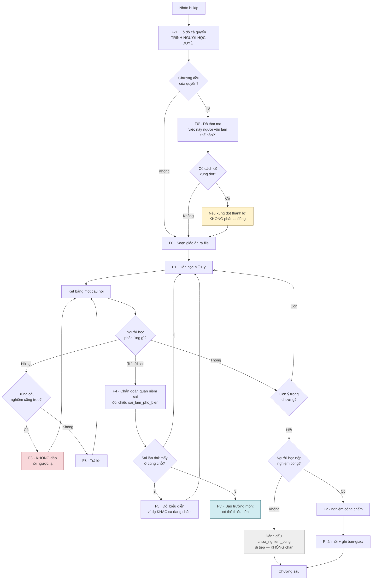

**Ba nhánh tô màu là ba chỗ dễ làm sai nhất:** nêu xung đột mà không phán ai đúng · không đáp câu nghiệm công đang treo · và bỏ qua nghiệm công thì **đi tiếp, không chặn**.

## 7.1 Sáu luật dạy — viết thẳng vào SKILL.md

1. **Mỗi lượt tối đa một ý, kết bằng một câu hỏi.** Không trình bày ý tiếp theo cho tới khi có câu trả lời.
2. **Ghi vào giáo án KẾT QUẢ của mỗi nước đi, không chỉ nước đi.** "Ví dụ A → vẫn vấp → đổi mô hình B → thông."
3. **Giàn giáo được dày lên giữa chừng**, không chỉ mỏng dần.
4. **Không đáp câu hỏi trùng câu nghiệm công đang treo.** Hỏi ngược lại.
5. **Giảng lại bằng ví dụ khác, không dùng ca đang được nghiệm công.**
6. **Không có tình huống thật thì vẫn dạy**, nhưng nói rõ đang ở tầng nông hơn.

Luật 2 rẻ mà vá ba chỗ: F5 chọn được cách khác thật · giàn giáo tăng lại được · F10 chỉ đúng chỗ chương viết hỏng.

## 7.2 Dò tâm ma — F0′

Chạy **một lần ở chương đầu mỗi quyển**, không lặp mỗi chương. Tâm ma là thứ người học **mang sẵn vào**, không phát sinh theo chương — hỏi lại ở chương 4 là ma sát vô ích, và tâm ma đã ghi ở `ban-giao/tam-ma/` rồi.

Thư linh hỏi **"việc này ngươi vốn làm thế nào?"**

| Trả lời | Làm gì |
|---|---|
| Chưa từng làm | Không có tâm ma. Dạy thẳng — **không bịa ra một cái** |
| Có cách cũ, không xung đột | Ghi nhận, dùng làm cầu nối sang cách mới |
| Có cách cũ, xung đột với chương | Ghi tâm ma. **Nêu xung đột ra thành lời trước khi dạy tiếp** |

Cơ chế nằm ở dòng cuối: xung đột không được gọi tên thì người học **lặng lẽ nhét nội dung mới vào khung cũ** — nghe hiểu hết, làm vẫn như trước. Đây là chỗ hỏng mà `sai_lam_pho_bien` không bắt được, vì lỗi không phát sinh trong chương; nó có sẵn từ trước.

**Nêu xung đột, không phán ai đúng.** Cách cũ của người học có thể đúng trong hoàn cảnh của họ, và sách có thể không hợp bối cảnh đó. Thư linh nói *"cách cũ hợp lý khi X, nhưng chương này giả định Y"* — rồi để người học tự quyết. Hệ tự nguyện không gác cổng, kể cả gác nhân danh quyển sách.

## 7.3 Hai nhánh không phải happy path nhưng bắt buộc có

**F8 — nối lại mạch cũ** là chế độ phổ biến nhất của người tự học. Kích hoạt khi vào một chương dở ở **phiên mới**, không phải khi qua một ngưỡng ngày: thứ đã mất là ngữ cảnh, và ngữ cảnh mất theo phiên chứ không theo lịch. Thư linh hỏi lại một hai câu của chương trước rồi mới quyết vào đâu — nhớ tốt thì đi tiếp ngay, quên thì lùi lại. **Chính câu trả lời là thước đo**, không phải số ngày.

**F9 — xuất quan là TẠM DỪNG, không phải dứt.** Bỏ cuộc là hợp lệ trong hệ tự nguyện; không có đường rút thì người ta im lặng biến mất, mất cả người lẫn dữ liệu quý nhất. Xuất quan ghi lý do và **giữ nguyên lộ đồ cùng giáo án**; quay lại thì vào F8, không phải dựng lộ đồ mới.

**Bỏ qua nghiệm công là hợp lệ.** Người học đọc xong chương mà không nộp gì thì chương đánh dấu `chua_nghiem_cong` và đi tiếp — không chặn. Cái giá họ tự chịu: chương đó **không có bằng chứng**, nên không làm nguồn cho định vị (R10 đòi ≥2 nguồn), và nếu bỏ qua nhiều thì trưởng lão trả *"chưa đủ để định cảnh giới"*.

**F5′ — sai lần ba cùng một chỗ.** F4 chẩn đoán, F5 đổi biểu diễn. Lần ba thì vấn đề không nằm ở cách trình bày mà nhiều khả năng ở **nền**: `gia_dinh_nen` của chương không đúng với người học này. Thư linh báo trưởng môn thay vì giảng lại lần nữa — nó chỉ nhìn được một quyển, còn *"học gì trước"* là câu của trưởng môn.

Không có F5′ thì thư linh giảng lại vô hạn, và người học kẹt ở một chương cho tới khi bỏ cuộc.

**Phục mệnh phải nhận cả báo cáo thất bại.** Lịch luyện hỏng mang nhiều thông tin hơn thành công — nó chỉ đúng chỗ bí kíp không dùng được ngoài đời.

---

# 8 · YÊU CẦU

| ID | Ai | Được / không được làm gì | Kiểm đạt bằng cách nào |
|---|---|---|---|
| R1 | Thư linh | Không kết luận đã xong khi câu trả lời chỉ ở tầng Nhớ/Hiểu | Bài nghiệm công vận dụng được vào tình huống cụ thể, không chỉ nhắc lại |
| R2 | Thư linh | Không có tình huống thật thì vẫn dạy, nói rõ tầng nông hơn | Chạy thử với người học không nêu tình huống |
| R3 | Thư linh | Soạn lộ đồ ra file và **trình duyệt** trước khi dẫn học | `lo-do/<bí kíp>.json` tồn tại và có `duyet_luc` |
| R4 | Thư linh | Soạn giáo án ra file trước mỗi chương | `giao-an/<bí kíp>/<chương>.json` tồn tại |
| R5 | Thư linh | Không đáp câu trùng câu nghiệm công đang treo | Nhật ký F3 ghi các câu đã né |
| R6 | Thư linh | Giảng lại bằng ví dụ khác | Ví dụ trong giáo án ≠ tình huống người học |
| R7 | Trưởng môn | Gợi ý, **không ép**; luôn có lối tự nhập | Mọi màn gợi ý có ≥1 lối thoát |
| R8 | Trưởng môn | Nói rõ gợi ý đến từ dữ liệu hay suy đoán | Đối chiếu bảng quyết định §10.3 |
| R9 | Trưởng lão | Không nhận giáo án và ghi chép dạy | Subagent tươi; `pham_vi_doc` không chứa `thu-linh/**` |
| R10 | Trưởng lão | Định cảnh giới dựa trên ≥2 nguồn **và** k lần đồng thuận. Nguồn = bài nộp của **mọi bí kíp gắn thẻ mạch đó** | Dưới ngưỡng → "chưa đủ để định cảnh giới" |
| R11 | Hệ | **Không công bố cảnh giới khi hiệu chuẩn κ < 0,6** | Sổ hiệu chuẩn §11 |
| R12 | Chú giải | Không mang chi tiết tình huống thật ra ngoài | Đọc chú giải: không có tên người, công ty, dự án |
| R13 | Bí kíp | Thiếu trường của mức **đủ dùng** → không vào tàng kinh các. **Rỗng ≠ vắng** | `kiem-bi-kip.py --muc du-dung` fail |
| R13b | Thư linh | Chương mức **đủ dùng** → nói rõ **trước khi người học làm bài**, không nói sau | Câu báo phải nêu *tiêu chí còn thô nên sẽ hỏi kỹ hơn bằng miệng*, không nêu *chấm lỏng hơn* |
| R14 | Người học | Tự nhập vai và mạch mới | Nhập tên chưa có → tạo, kèm gợi ý mục tương tự |
| R15 | Tàng kinh trưởng lão | Ghi bí kíp gốc **chỉ lúc thu**; sau đó bí kíp bất biến | Mọi bồi đắp đi vào `chu-giai/`, không sửa `bi-kip/` |
| R16 | Mọi vai | Chỉ ghi trong thư mục mình sở hữu | Soát nhật ký ghi file theo vai |
| R17 | Thư linh | Dò tâm ma ở F0; có xung đột thì **nêu thành lời trước khi dạy tiếp**, không phán ai đúng | `ban-giao/tam-ma/` có bản ghi, hoặc giáo án ghi rõ "không có tâm ma" |
| R18 | Thư linh | **Không tự tuyên bố** tâm ma đã gỡ. **Thừa nhận ≠ gỡ**: lời người học chỉ đưa tới `dang_go` | `da_go` chỉ ghi kèm dẫn chứng từ nghiệm công hoặc khảo thí |
| R19 | `nghiem-cong` | **Bằng chứng trước khẳng định** | Mỗi mục `theo_tieu_chi` có `dan_chung` không rỗng. Rỗng → **trả lại yêu cầu trích một lần**; vẫn rỗng → chưa đạt, kèm cờ `thieu_dan_chung` |
| R20 | Giám khảo | Sinh đề, coi thi — **không được chấm** | Thư gửi đi chứa đề + bài; không chứa phán quyết |
| R21 | Trưởng môn | Xử bất đồng và `khong_ro`; **không nhánh nào chặn người học** | Ba nhánh bất thường đều cho qua, mỗi nhánh một loại cờ trong `bat-dong.jsonl` (§9.4) |
| R22 | Thư linh | Sai lần ba cùng chỗ → **báo trưởng môn**, không giảng lại lần nữa | F5′ có bản ghi trong giáo án |
| R23 | Hệ | Chương **bỏ qua nghiệm công vẫn tính là đã qua** | Không chặn vào khảo thí; chương đó không làm nguồn định vị |
| R24 | Tài liệu | Mọi ví dụ trong đặc tả và `tham-chieu/` là **ví dụ tổng hợp**, không lấy từ bí kíp có thật | Soát: không ví dụ nào trùng nội dung một bí kíp trong kho |
| R25 | Hệ | Mỗi ràng buộc cấm-đọc có **một ca đối chứng** ở §11.3 | R9 · phúc khảo · chú giải — thiếu ca thì ràng buộc đó chưa được chứng minh |
| R26 | Mọi thư mục con của `ban-giao/` | Có `.pham-vi.json` khai `ghi` (một vai) và `doc` (danh sách vai) | Thiếu file → coi như **không vai nào đọc được**, fail an toàn |
| R27 | Mọi vai | `pham_vi_doc` trong thư phải là **tập con** của `doc` trong `.pham-vi.json` | `kiem-thu.py` đối chiếu trước khi gọi subagent |
| R28 | nghiệm công | Thấy người học **làm nhiều hơn tiêu chí đòi** → ghi ứng viên vào `ung-vien-boi/tieu-chi/` | Có bản ghi kèm trích dẫn câu vượt tiêu chí |
| R29 | Trưởng môn | Bất đồng loại `tieu_chi_khong_phan_biet` → chép **nguyên văn** `nhan_dinh` của phúc khảo vào `bat-dong.jsonl`, không tóm tắt | Bản ghi có `nhan_dinh_phuc_khao` và `ung_vien_tieu_chi` |
| R30 | Trưởng lão | `dau_hieu[]` **không được chứa nhãn bậc**; nhãn chỉ nằm ở `bac` và `nhan_dinh` | `kiem-thu.py` quét `dau_hieu[]` tìm 5 tên cảnh giới → có thì fail |
| R31 | Vai cầm lượt | `bac: null` → dựng câu từ `thieu` + `dau_hieu[]`, **không** từ `nhan_dinh` | Câu nói với người học không chứa tên cảnh giới nào |

---

# 9 · HAI NGƯỜI SOÁT TRỰC GIAO

## 9.1 Chỉ ở khảo thí quyển

| | Nghiệm công chương | **Khảo thí quyển** |
|---|---|---|
| Người soát | `nghiem-cong` | `nghiem-cong` **+ `phuc-khao`** |
| Vì sao | Phản hồi để học tiếp | **Đây là tiêu chí đạt của cả hệ** (§1.3) |

Chương chấm một lần là đủ — sai thì còn chương sau sửa. Khảo thí quyển là chỗ tuyên bố đột phá, và một lần chấm sai ở đó thì không có gì đỡ.

Chi phí vì vậy là **một lượt thêm mỗi quyển**, không phải gấp đôi mỗi chương.

## 9.2 Trực giao nghĩa là hỏi câu khác nhau

| | `nghiem-cong` | `phuc-khao` |
|---|---|---|
| Đọc | Bài làm **+ `tieu_chi_dat`** | Bài làm **+ `muc_tieu` của quyển** — **không đọc tiêu chí** |
| Hỏi | Bài này có đạt từng tiêu chí không? | Người viết bài này **làm được việc mà mục tiêu nói** chưa? |
| Trả | `theo_tieu_chi[]` + `dan_chung` | `lam_duoc: co/chua/khong_ro` + `nhan_dinh` |
| Bắt được | Thiếu sót so với rubric | **Bài lọt rubric mà vẫn rỗng** |

`phuc-khao` không thấy tiêu chí là **chủ ý**: thấy tiêu chí thì nó chấm lại đúng thứ `nghiem-cong` vừa chấm, và trực giao mất.

**Cơ chế trực giao nằm ở đâu.** Không phải ở thái độ — không phải một vai khắt khe hơn vai kia. Nó nằm ở chỗ **tiêu chí là bản diễn giải có mất mát của mục tiêu**: nghiệm công đọc bản diễn giải, phúc khảo đọc bản gốc. Chỗ mất mát chính là chỗ bất đồng lộ ra.

Điều này cũng giải thích vì sao phúc khảo chỉ đặt ở **khảo thí quyển**: chỉ ở cấp quyển mới có `muc_tieu` đủ rộng để chỗ lệch hiện ra. Ở cấp chương, mục tiêu hẹp gần bằng tiêu chí, nên hai vai sẽ luôn khớp và vai thứ hai thành thừa.

## 9.3 Luồng khảo thí quyển

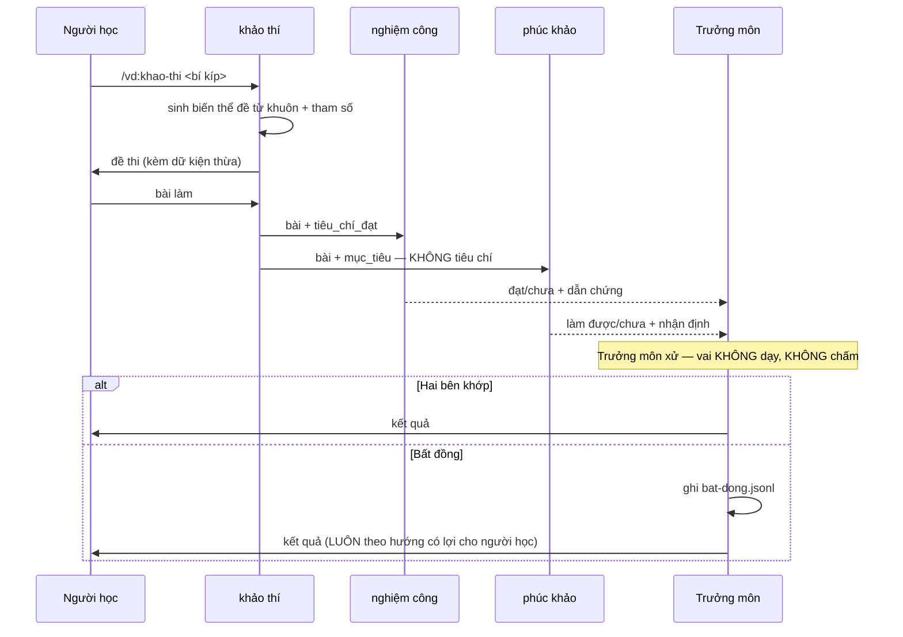

## 9.4 Bốn nhánh — không nhánh nào chặn người học

| `nghiem-cong` | `phuc-khao` | Người học | Ghi lại gì |
|---|---|---|---|
| Đạt | Làm được | **Đột phá** | — |
| Chưa đạt | Chưa làm được | Chưa qua, học tiếp | — |
| **Đạt** | **Chưa làm được** | **Vẫn đột phá** | Cờ **tiêu chí không phân biệt** — bài lọt rubric mà rỗng |
| **Chưa đạt** | **Làm được** | **Vẫn đột phá** | Cờ **tiêu chí quá hẹp** — làm được theo cách khác |
| Đạt | **`khong_ro`** | **Vẫn đột phá** | Cờ **đề không ép khẳng định** — xem dưới |

**Nhánh `khong_ro` không phải bất đồng.** Nghiệm công *đạt*, phúc khảo *không kết luận được* — khác với hai bên nói ngược nhau.

Nó xuất hiện khi bài làm **không sai gì cả, chỉ không đi tới cùng**: chọn đúng nhóm, loại trừ đúng, rồi dừng ở *"còn tuỳ đặc điểm dữ liệu"*. Cả hai vai đều không có căn cứ nói chưa làm được, vì không có gì hỏng để chỉ ra.

**Thủ phạm là đề, không phải tiêu chí.** Đề hỏi *"nên dùng cách tiếp cận nào"* thì trả lời bằng liệt kê vẫn hợp lệ. Cờ `de_khong_ep_khang_dinh` trỏ về `khao_thi_quyen`, không trỏ về `tieu_chi_dat`.

**Cả ba nhánh bất thường đều cho qua.** Hệ không gác cổng, và một tín hiệu yếu hơn không được phép chặn người học. Giá trị của phúc khảo **không nằm ở việc chặn** — nó nằm ở cái cờ để lại.

**Trưởng môn xử, không phải thư linh.** Thư linh là người dạy; cho nó phân xử bất đồng về kết quả dạy của chính nó là mở lại đúng xung đột mà `nghiem-cong` sinh ra để đóng. Trưởng môn không dạy, không chấm — nó chỉ ghi nhận và định tuyến.

## 9.5 Cờ bất đồng là mẫu miễn phí

Ghi vào `~/.vandao/truong-mon/bat-dong.jsonl`:

```json
{ "bi_kip": "kiem-thu-dac-ta", "loai": "tieu_chi_khong_phan_biet",
  "nghiem_cong": "dat", "phuc_khao": "chua_lam_duoc",
  "tieu_chi_nghi_ngo": ["kq2"],
  "nhan_dinh_phuc_khao": "Đoạn cuối đảo trục: chọn bằng con số hiệu năng chứ không
    bằng đặc điểm dữ liệu. Người viết dừng ở mức chọn đúng NHÓM, chưa chọn được cách
    tiếp cận trong nhóm.",
  "ung_vien_tieu_chi": "đòi chọn được cách tiếp cận TRONG nhóm, dựa trên đặc điểm dữ liệu",
  "luc": "…" }
```

**`nhan_dinh_phuc_khao` chép nguyên vào bản ghi, không tóm tắt.** Đây là chỗ phúc khảo nói ra **thiếu vế gì** — thông tin đắt nhất trong cả lần bất đồng. Chỉ ghi `tieu_chi_nghi_ngo: [kq2]` thì biết tiêu chí nào hỏng mà không biết hỏng ra sao, và lần sửa pha 2 phải đoán lại.

**Không thêm đường ghi nào.** Phúc khảo vẫn chỉ trả thư; trưởng môn vẫn là vai duy nhất ghi `bat-dong.jsonl`. Luật một-người-ghi không đổi.

**Hai cấp, hai sổ:**

| Sổ | Cấp | Ai ghi | Phát hiện lúc |
|---|---|---|---|
| `ung-vien-boi/tieu-chi/` | Chương | nghiệm công | Nghiệm công chương |
| `bat-dong.jsonl` | Quyển | trưởng môn | Khảo thí quyển |

Tàng kinh trưởng lão đọc **cả hai** khi bồi bí kíp lên đủ chuẩn — một sổ cho tiêu chí chương, một sổ cho tiêu chí khảo thí.

§11.1 vốn chỉ bắt được lỗi tiêu chí **lúc hiệu chuẩn** — tức phải chủ động ngồi chấm 20 bài. Cờ bất đồng bắt được **ngay trong lúc dùng**, và mỗi cái là một mẫu không tốn công thu.

Đủ vài cờ trên cùng một quyển thì đó là tín hiệu quay lại pha 2 sửa `khao_thi_quyen`.

---

# 10 · CHỈ ĐIỂM

## 10.0 Bái sư và chỉ điểm

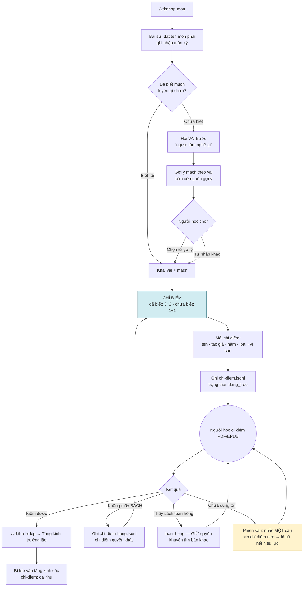

**Ba con số và một nhánh đáng chú ý:**

**Số chỉ điểm khác nhau theo nhánh:**

| Nhánh | Số quyển | Vì sao |
|---|---|---|
| **Đã biết** muốn luyện gì | 3 công pháp + 2 tâm pháp | Có động lực và biết mình cần gì — năm quyển là một thực đơn để chọn |
| **Chưa biết** | **1 + 1**, kèm *"thỉnh được rồi quay lại, ta chỉ tiếp"* | Người vừa nói *"chưa rõ lắm"* mà nhận năm quyển phải đi kiếm là **chuyển gánh nặng chọn lựa** sang đúng người vừa nói mình không biết chọn |

Cả hai là **mặc định**, chỉnh được qua `so_chi_diem` trong `customize.toml`. Xin thêm thì chỉ tiếp.

**Nhánh "chưa biết muốn học gì" hỏi VAI trước, không hỏi mạch.** Vai là thứ ai cũng trả lời được — *"tôi làm tester"*. Mạch là khái niệm của hệ, người mới không biết trả lời. Từ vai suy ra mạch, kèm **cờ nguồn gợi ý** theo bảng §10.3.

**Chỉ điểm chưa thu được nhắc lại.** Không nhắc thì mỗi phiên là một danh sách mới, và người học tích một đống tên sách chưa bao giờ đi kiếm. Nhắc là *"ngươi còn 2 quyển chưa thỉnh về"* — một câu, không nài.

## 10.1 Người học vào với phương hướng đã có

Đệ tử **tự khai vai và mạch muốn luyện** — họ đã biết mình muốn phát triển gì. Việc chính của trưởng môn ở lượt đầu **không phải chọn mạch hộ, mà là gọi tên sách để đệ tử đi kiếm về**.

Đây là mắt xích khiến hệ khởi động được từ số không: tàng kinh các ban đầu **rỗng**.

Không có bộ phân loại vai/mạch cố định — người học tự nhập, `thuat-ngu.json` giữ bí danh (§9.4).

## 10.2 Một chỉ điểm gồm gì

| Trường | Vì sao cần |
|---|---|
| Tên sách | Để đi kiếm |
| Tác giả | Phân biệt sách trùng tên |
| Năm / ấn bản | Kiếm đúng bản |
| Công pháp hay tâm pháp | Biết nó phục vụ vai hay nền |
| Vì sao quyển này | Để **bỏ** nếu thấy không hợp |

**Luật chống bịa:** model gợi ý từ hiểu biết sẵn có, nên phải nêu đủ ba dữ kiện đầu — ba thứ cụ thể khó bịa trót lọt hơn một cái tên trần. Và **không chắc thì nói không chắc**, đừng bù bằng một cái tên nghe được.

**Ba trạng thái của một chỉ điểm**, ghi trong `truong-mon/chi-diem.jsonl`:

| Trạng thái | Nghĩa | Trưởng môn làm gì |
|---|---|---|
| `dang_treo` | Đã chỉ, chưa đụng tới, **còn hiệu lực** | Nhắc **một câu** ở phiên sau |
| `het_hieu_luc` | Bị chỉ điểm mới thay thế | Không nhắc. Vẫn tra ra được nếu đệ tử hỏi |
| `da_thu` | Đã vào tàng kinh các | Không nhắc nữa |
| `ban_hong` | **Kiếm thấy sách, bản này không rút được chữ** | Giữ nguyên quyển trong chỉ điểm; khuyên tìm bản khác |
| `khong_thay` | Kiếm không ra **sách** | Ghi `chi-diem-hong.jsonl`, chỉ quyển khác |

**`ban_hong` khác `khong_thay` ở chỗ quyết định.** Bản scan không rút được chữ nghĩa là **sách đúng, bản in sai** — gạch tên quyển đó khỏi chỉ điểm là mất một quyển hay vì một lỗi phân loại. `chi-diem-hong.jsonl` **chỉ dành cho `khong_thay`**.

**Vòng quay lại khi kiếm không thấy.** Đệ tử báo *"không tìm được quyển này"* → trưởng môn chỉ điểm quyển khác, và ghi vào `truong-mon/chi-diem-hong.jsonl`.

Không có vòng này thì mỗi lần mở máy đệ tử lại nhận đúng quyển sách không tồn tại.

### Chỉ điểm mới thay chỉ điểm cũ, không cộng dồn

Xin chỉ điểm lần nữa → mọi mục `dang_treo` chuyển thành `het_hieu_luc`, danh sách mới thay hẳn.

**Chỉ điểm là lời khuyên cho lúc này, không phải sổ nợ.** Xin lần nữa nghĩa là lần trước không hợp — cộng dồn thì sau ba tháng đệ tử mang một danh sách mười hai quyển chưa thỉnh, và mỗi phiên bị nhắc một câu về nó. Một câu mỗi phiên vẫn là **nài**, chỉ là nài chậm.

Không cộng dồn nên **không cần đếm số lần nhắc** — không thêm tham số nào vào hệ vốn đã bỏ hết mốc đếm.

Cái giá: đệ tử thỉnh được quyển thứ nhất, xin chỉ điểm tiếp, thì bốn quyển cũ rời khỏi danh sách treo. Vẫn nằm trong `chi-diem.jsonl` — hỏi *"quyển Wiegers kia sao rồi"* thì trưởng môn tra ra được và đưa lại. Cùng luật với danh sách hỏng: **trí nhớ, không phải lệnh cấm.**

**Nhớ, nhưng không cấm.** Trưởng môn **không tự đề xuất lại** tên đã nằm trong danh sách hỏng. Nhưng đệ tử hỏi thẳng — *"quyển X kia sao rồi"* — thì vẫn đưa ra, kèm ghi chú *"lần trước ngươi kiếm không thấy"*.

Lý do không khoá vĩnh viễn: sách không tìm được hôm nay có thể tìm được sau — mua được bản khác, hoặc tên chỉ nhớ nhầm một chữ. Danh sách hỏng là **trí nhớ**, không phải lệnh cấm.

## 10.3 Công pháp chọn, tâm pháp đi kèm

Đệ tử chọn **công pháp** theo vai. Trưởng môn chỉ điểm sách công pháp, **kèm tâm pháp đỡ trần cho nó**.

Ví dụ: công pháp *BABOK* cho vai BA → tâm pháp gợi ý *tư duy phản biện*, vì elicit yêu cầu là tách nhu cầu khỏi giải pháp đã bị áp đặt.

**Bảng quyết định — công pháp nào cần tâm pháp gì:**

| Có dữ liệu thật (≥5 người cùng vai)? | Có khai từ bí kíp? | Trưởng môn làm gì |
|---|---|---|
| Có | — | Gợi ý kèm số |
| Không | Có | Gợi ý kèm nguồn |
| Không | Không | Gợi ý kèm **cảnh báo: đây là suy đoán** |
| — | — | **Luôn** kèm lối "ta tự nhập tâm pháp khác" |

**Dòng ba là ca MẶC ĐỊNH, không phải ca dự phòng.** Kho rỗng thì không có dữ liệu thật lẫn khai báo từ bí kíp — nên ở n=1, mọi chỉ điểm đều ở mức suy đoán trong **nhiều tháng đầu**, cho tới khi có đủ bí kíp trong kho để dòng hai chạy.

Hệ quả với `truong-mon/SKILL.md`: câu rào **là một bước bắt buộc trong luồng chỉ điểm**, không phải một dòng trong bảng tra. Trưởng môn nói câu rào **trước khi đưa danh sách**, không phải sau:

> *"Ta chưa có dữ liệu nào về vai này — những gì nói sau đây là suy đoán, ngươi thấy không hợp thì bỏ."*

Nói sau danh sách thì người học đã đọc xong và đã tin. Dòng cuối là R7 — đệ tử có thể đã biết mình thiếu gì mà trưởng môn không đoán ra.

**Tâm pháp học song song, chạy nền.** Vào công pháp ngay; tâm pháp mở sẵn trong bản đồ. Trưởng môn chỉ **đẩy nó lên khi có dấu hiệu**: vấp lặp ở cùng một chỗ, hoặc cảnh giới công pháp không nhích qua vài lần định lại. Lúc đó câu *"chiêu thức ngươi đủ rồi, thiếu là ở nội công"* mới có căn cứ, thay vì là lời khuyên suông từ ngày đầu.

## 10.4 Chống vỡ thuật ngữ

"Tư duy phản biện" · "Critical thinking" · "Phản biện" thành ba mục rời thì quan hệ loãng và gợi ý mãi kẹt ở mức suy đoán. Ba lớp, không lớp nào ép: gợi ý khi gõ · bí danh trong `thuat-ngu.json` · hợp nhất định kỳ.

---

# 11 · HIỆU CHUẨN ĐỊNH CẢNH GIỚI

Trước khi hệ được phép công bố cảnh giới:

| Bước | Nội dung |
|---|---|
| 1 | Thu 20 bài nghiệm công thật, phủ nhiều mạch và nhiều mức |
| 2 | **Người chấm trước**, mù với kết quả model |
| 3 | Chạy định cảnh giới k=3 trên cùng 20 bài |
| 4 | Đo mức khớp giữa nhãn người và bậc model (κ) |
| 5 | **κ < 0,6 → không công bố bậc.** Chỉ trả mô tả dấu hiệu quan sát được |
| 6 | Ghi vào sổ; lặp lại khi đổi rubric |

## 11.1 Kiểm tiêu chí có phân biệt được không

κ chỉ đo **người và model có chấm khớp nhau không**. Hai bên khớp hoàn hảo trên một tiêu chí vô dụng vẫn cho κ cao — nên κ không bắt được lỗi này.

**Tiêu chí không phân biệt** là tiêu chí mà người **chưa đọc chương** cũng đạt. Nó làm khảo thí *trông như* đang đo cái gì đó.

Phép kiểm, chạy một lần cho mỗi bí kíp mới ở pha 2: viết một bài trả lời **chỉ dựa vào hiểu biết chung**, không mở chương ra, rồi đưa cho `nghiem-cong`. **Đạt → tiêu chí đó vứt đi, viết lại.**

Khái niệm mượn từ analyzer của `skill-creator`: assertion luôn pass bất kể có skill hay không thì không đo gì cả.

## 11.2 Sai ở đâu — năm nguồn

κ đo **model cộng harness cùng lúc**, không đo model trần. Một con số κ thấp mà không biết sai ở đâu thì lần hiệu chuẩn sau lặp lại y hệt lần đầu.

Mỗi lần chấm lệch, xếp vào một trong năm ô:

| Nguồn | Dấu hiệu | Sửa ở đâu |
|---|---|---|
| **Model yếu** | Ca đối chứng §10.3 không đổi kết quả | Không sửa được ở tầng này |
| **Harness yếu** | Đổi ngữ cảnh thì kết quả đổi | `pham_vi_doc` · rubric chưa nạp · subagent bị fork thay vì tươi |
| **Task mơ hồ** | Hai người chấm tay cũng bất đồng | Viết lại đề khảo thí |
| **Grader sai** | Tiêu chí không phân biệt (§10.1) | Viết lại `tieu_chi_dat` |
| **Nhiễu môi trường** | Bài nộp thiếu chữ, PDF rút lỗi | `giam-dinh` |

**Sổ hiệu chuẩn ghi cả hai:** con số κ **và** ô nào, đã vặn gì. Ghi mỗi κ thì lần sau không biết sửa từ đâu.

## 11.3 Ca đối chứng — tách harness khỏi model

**Bắt buộc mỗi lần hiệu chuẩn**, không phải chỉ khi nghi ngờ.

**Ba ràng buộc cấm-đọc, mỗi cái một ca đối chứng.** Ràng buộc không có ca đối chứng là ràng buộc **chưa bao giờ được chứng minh có tác dụng**:

| Ràng buộc | Lần A (đúng thiết kế) | Lần B (cố tình thêm ngữ cảnh cấm) |
|---|---|---|
| **R9** — trưởng lão không đọc giáo án | Chỉ bài nộp + tiêu chí bậc | Thêm giáo án và ghi chép dạy |
| **Phúc khảo** — không đọc `tieu_chi_dat` | Bài + mục tiêu | Thêm `tieu_chi_dat` của quyển |
| **Chú giải** — không đọc tình huống thật | Bảng tổng hợp vấp | Thêm `tinh-huong/` |

Ba ràng buộc còn lại (nghiệm công không đọc giáo án, giám khảo không chấm, thư linh không phán năng lực) kiểm bằng **soát payload**, không cần ca đối chứng — chúng là chuyện *có gửi hay không*, không phải chuyện *thấy rồi có đổi hành vi không*.

Ví dụ dưới đây cho R9 và phúc khảo — chạy hai lần trên **cùng một bài**:

| Lần | Ngữ cảnh |
|---|---|
| A | Đúng như thiết kế: chỉ bài nộp + tiêu chí |
| B | Thêm giáo án và ghi chép dạy vào ngữ cảnh |

**Kết quả đổi** → lỗi ở harness. Chứng minh luôn rằng R9 (cấm đọc `thu-linh/`) đang làm việc thật.
**Kết quả không đổi** → mới là model, hoặc là tiêu chí.

**Cái giá: hiệu chuẩn tốn gấp đôi** — 20 bài thành 40 lượt chấm. Chấp nhận có ý thức, vì κ không kèm ca đối chứng thì không nói được sai ở đâu, và một con số không chỉ ra chỗ sửa thì không đáng tin cậy để dựa vào.

Ghi cả hai cột A và B vào sổ hiệu chuẩn. Khoảng cách A–B **chính là** phần đóng góp của harness — đo được, không phải suy đoán.

Bước 5 là điều kiện đầu ra (R11), không phải khuyến nghị.

---

# 12 · TUỲ BIẾN VÀ QUY ƯỚC VIẾT SKILL

## 12.1 Bề mặt tuỳ biến

Mỗi skill có `customize.toml` khai **những gì được phép đổi**. Hai lớp:

| Lớp | File | Sửa? |
|---|---|---|
| Gốc | `<skill>/customize.toml` | Không — theo plugin, ghi đè mỗi lần cập nhật |
| Cá nhân | `~/.vandao/custom/<skill>.toml` | Có |

Luật gộp: **scalar ghi đè · mảng nối · mảng-bảng khớp `id` thì thay, mới thì thêm.** Override **thưa** — chỉ ghi trường muốn đổi, không chép cả file gốc.

Phơi ra ở bậc 1:

| Thành phần | Trường phơi ra |
|---|---|
| `truong-mon` | `persistent_facts` · `catalog_them` · `so_chi_diem` (mặc định 3 công pháp + 2 tâm pháp) |
| `thu-bi-kip` | `bi_kip_template` · `pha2_reviewers` · `ngan_sach_token` |
| `thu-linh` | `persistent_facts` · `doc_standards` · `khuon_cau_hoi_them` · `so_lan_giang_lai` (mặc định 2, lần 3 → F5′) |
| `khao-thi` | `so_bien_the` (cảnh báo khi số bộ < số lần thi dự kiến) · `du_thua_them` |
| `nghiem-cong` | `rubric_them` · `so_lan_doi_dan_chung` (mặc định 1) |
| `phuc-khao` | `nguong_khong_ro` |
| `truong-lao` | `rubric_canh_gioi` · `k` (mặc định 3) |
| `chu-giai` | `mau_issue` |

Chưa có lớp nhóm. Một người dùng thì hai lớp là đủ; thêm lớp thứ ba khi có người thứ hai.

**Luật chống bịa:** khi `customize.toml` không phơi ra thứ người dùng muốn, **nói thẳng, không bịa trường**.

## 12.2 Phạm vi đọc tài liệu

`pham_vi_doc` trong thư gác **dữ liệu người học**. Mỗi agent còn đọc một tập nữa chưa ai gác: **tài liệu thiết kế** — SKILL.md, file khai trong `skills:`, `tham-chieu/`.

**Đặc tả là tài liệu chung, mọi agent đọc được.** Biết *lược đồ tiêu chí có hình dạng gì* khác hẳn biết *tiêu chí của chương này là gì* — chỉ cái sau mới phá cách ly, và `pham_vi_doc` đã gác nó. Một người soát biết rõ nhiệm vụ của mình còn đáng tin hơn một người soát mù mờ.

**`tham-chieu/` giữ phẳng**, không chia theo vai. Mỗi agent khai tường minh trong `skills:` thứ nó cần:

| Agent | `skills:` nạp sẵn |
|---|---|
| `nghiem-cong` | `loai-cau-hoi` |
| `phuc-khao` | *(không nạp `loai-cau-hoi`)* |
| `truong-lao` | `canh-gioi` |
| `chu-giai` | `mau-issue` |
| `tra-tang-kinh-cac` | `catalog.schema` |

Khai tường minh tốt hơn chia thư mục: nó nằm ngay trong file agent, đọc một chỗ là biết, và không sinh ra bản sao tài liệu để trôi lệch.

### Rủi ro còn lại: ví dụ trong tài liệu

Đặc tả và tham chiếu chứa **ví dụ cụ thể**. Ví dụ rút từ bí kíp thật là rò rỉ instance qua đường tài liệu — `phuc-khao` đọc được một tiêu chí thật dù chưa bao giờ chạm `tieu_chi_dat`.

**Luật: mọi ví dụ trong đặc tả và `tham-chieu/` phải là ví dụ tổng hợp**, không lấy từ bí kíp có thật trong kho. Rẻ, và nó đóng lỗ duy nhất mà "đọc tự do" để hở.

## 12.3 Script có, văn bản cũng phải có

Mọi script trong `bin/` phải kèm **luật tương đương viết bằng lời** trong tham chiếu, để khi script hỏng hoặc thiếu Python thì skill làm tay được và nói rõ đang làm tay.

Script cho tất định, văn bản cho bền. Không có vế sau thì một máy thiếu Python là hệ đứng.

## 12.4 Ba quy ước mọi SKILL.md phải có

**Xong khi** — điều kiện kết thúc quan sát được. Chưa đạt thì hoặc làm nốt, hoặc nói thẳng với người dùng là đang thoát giữa chừng.

**Khi nào skill này không giúp được** — liệt kê trường hợp ngoài phạm vi kèm chỗ chuyển tiếp. Ngoài phạm vi đặt trong công cụ, không phải chỉ trong tài liệu thiết kế.

**Trình → xác nhận → ghi → kiểm.** Không ghi đè im lặng; có file cũ thì hiện diff; ghi xong thì kiểm lại và chỉ ra chỗ đã đổi. **Kiểm thấy không ăn thì quay lại bước soạn với chính kết quả kiểm làm ngữ cảnh** — vòng tự sửa, không phải "đã ghi xong là xong".

## 12.5 Micro-file cho thư linh

Thư linh tách `buoc/` — mỗi bước dạy một file, SKILL.md chỉ giữ định tuyến. Luật *không được sang bước sau khi bước hiện tại nói phải chờ người học* nằm **trong chính file bước**, không nằm trong lời dặn chung.

Đây là luật dạy số 1 (§7.1) được thực thi bằng **cấu trúc file** thay vì bằng lời — và nó giữ SKILL.md nhỏ, nạp dần theo bước.

---

# 13 · THÀNH PHẦN

## 13.0 Phân rã theo năng lực

Bảng ở §13.1 nhóm theo **bậc dựng**. Hình này nhóm theo **năng lực** — cùng 28 thành phần, lát cắt khác.

```mermaid
flowchart TD
    VD["VẤN ĐẠO"]
    VD --> A["THU SÁCH"]
    VD --> B["DẠY"]
    VD --> C["SOÁT"]
    VD --> D["ĐỊNH HƯỚNG"]
    VD --> E["ĐO"]
    VD --> F["NỀN"]

    A --> A1["skill: thu-bi-kip"]
    A --> A2["script: giam-dinh · kiem-bi-kip · tang-kinh-cac"]
    A --> A3["tham chiếu: bi-kip.schema"]

    B --> B1["skill: thu-linh · nhap-mon · ha-son · phuc-menh"]
    B --> B2["tham chiếu: lo-do.schema · loai-cau-hoi"]
    B --> B3["rule: trong-bi-kip"]

    C --> C1["skill: khao-thi"]
    C --> C2["subagent: nghiem-cong · phuc-khao"]

    D --> D1["skill: truong-mon"]
    D --> D2["subagent: tra-tang-kinh-cac"]
    D --> D3["script: ban-do"]
    D --> D4["tham chiếu: mach.schema · ho-so.schema"]

    E --> E1["skill: dao-tam"]
    E --> E2["subagent: truong-lao ×3 · chu-giai"]
    E --> E3["script: thoai-canh"]
    E --> E4["tham chiếu: canh-gioi"]

    F --> F1["hook: nap-ho-so · kiem-thu · ghi-nhat-ky"]
    F --> F2["script: kiem-thu"]
    F --> F3["tham chiếu: thu.schema"]

    style C fill:#d4edda,stroke:#155724
    style E fill:#d1ecf1,stroke:#0c5460
    style F fill:#eeeeee,stroke:#888
```

**Sáu năng lực, và ranh giới giữa hai cái ở giữa là chỗ dễ nhầm:**

| Năng lực | Trả lời câu gì |
|---|---|
| **Thu sách** | Sách này vào kho được không, và thành lộ trình thế nào |
| **Dạy** | Chương này dạy ra sao |
| **Soát** | Bài này đạt chưa — **một lần, một bài** |
| **Định hướng** | Học gì tiếp, đang ở đâu trên bản đồ |
| **Đo** | Xuyên nhiều bài, nhiều quyển — cảnh giới, tiến bộ, chỗ bí kíp viết hỏng |
| **Nền** | Không trả lời câu nào của người học; giữ cho năm cái kia chạy đúng |

**Soát khác Đo ở phạm vi thời gian**: soát nhìn một bài tại một thời điểm; đo nhìn nhiều bài qua thời gian. Đó là lý do `nghiem-cong` và `truong-lao` không gộp được dù cùng là việc chấm.

**Nhóm Nền tách riêng vì nó xuyên suốt**: hook chạy ở mọi phiên, `kiem-thu.py` gác mọi thư giữa các vai. Rải chúng vào năm nhóm kia thì mỗi nhóm có một mảnh và không ai thấy chúng là một tầng.

**Thành phần phục vụ nhiều năng lực chỉ vẽ một lần**, ở năng lực chính. `nghiem-cong` chấm cả chương lẫn khảo thí nhưng đứng ở **Soát**; `chu-giai` sinh ra từ vấp lặp lúc dạy nhưng đứng ở **Đo**, vì nó nhìn xuyên nhiều lần vấp.

## 13.05 Skill nào thuộc vai nào

| Vai | Skill / agent |
|---|---|
| Trưởng môn | `truong-mon` · `nhap-mon` · `ha-son` · `phuc-menh` |
| Tàng kinh trưởng lão | `thu-bi-kip` |
| Thư linh | `thu-linh` |
| Giám khảo | `khao-thi` |
| Trưởng lão mạch | `truong-lao` (subagent ×3) |
| nghiệm công · phúc khảo · chú giải | subagent cùng tên |
| **Đệ tử** | `dao-tam` — `disable-model-invocation`, không vai nào ghi hộ |

Bốn skill của Trưởng môn là **bốn thao tác của cùng một vai**, không phải bốn vai. Chúng tách file vì kích hoạt ở bốn thời điểm khác nhau, không vì trách nhiệm khác nhau.

`tra-tang-kinh-cac` không thuộc vai nào — công cụ quét kho.

## 13.1 Ba bậc dựng

Ba bậc cộng dồn. **Luật chọn loại:** script nếu phải đúng *mọi lần* · hook nếu phải chạy *mọi lần ở một thời điểm* · subagent tươi nếu cần *ngữ cảnh sạch* · skill nếu cần *đối thoại* · tham chiếu nếu là *kiến thức*.

**Mọi file trong `agents/` phải khai ba thứ**, nếu không thì ranh giới ở §4.5 chỉ là lời nói:

| Khai | Vì sao |
|---|---|
| `skills:` | Tiêu chí nạp sẵn lúc khởi động, không nhét vào prompt |
| `tools:` | Bộ tool **hẹp nhất đủ dùng**. Hai subagent đọc-thuần khai chỉ-đọc; `chu-giai` và `nghiem-cong` mỗi cái khai thêm quyền ghi **đúng một đường dẫn**. Cách ly ngữ cảnh **không phải** cách ly hệ thống file |
| Phạm vi đường dẫn | Ghi trong `pham_vi_doc` của thư, soát lại được sau |

### Bậc 1 — LÕI

| # | Thành phần | Loại | Vai trò |
|---|---|---|---|
| 1 | `bi-kip.schema.md` | tham chiếu | Quy cách hai cấp: quyển và chương |
| 2 | `lo-do.schema.md` | tham chiếu | Quy cách lộ đồ bế quan |
| 3 | `ho-so.schema.md` | tham chiếu | Quy cách hồ sơ đệ tử |
| 4 | `canh-gioi.md` | tham chiếu | Dấu hiệu 5 cảnh giới, có ví dụ neo |
| 5 | `loai-cau-hoi.md` | tham chiếu | 4 loại câu, 2 loại tính bằng chứng |
| 6 | `kiem-bi-kip.py` | **script** | Kiểm đủ trường + đồ thị phụ thuộc |
| 7 | `tang-kinh-cac.py` | **script** | Đọc `tang-kinh-cac.csv`, dựng hai khung nhìn + suy trạng thái từ `ban-giao/` |
| 8 | `nhap-mon` | skill | Bái sư, khai hồ sơ |
| 9 | `thu-bi-kip` | skill · **vai Tàng kinh trưởng lão** | Giám định + phân giải PDF/EPUB, ba pha |
| 9b | `giam-dinh.py` | **script** | Rút text · lấy mục lục · đoán cấu trúc chuỗi/mạng · vân tay file |
| 10 | `thu-linh` | skill | F-1 → F5 |
| 11 | `dao-tam` | skill · `disable-model-invocation` · **đệ tử sở hữu** | Ghi nhật ký con đường, có `kiem_chung` |
| 11c | `nghiem-cong` | **subagent tươi** | Chấm nghiệm công chương **và khảo thí quyển**, không thấy giáo án. Ghi được **đúng một đường dẫn**: `ung-vien-boi/tieu-chi/` (R28) |
| 11b | `khao-thi` | skill · **vai Giám khảo** | Sinh biến thể đề từ khuôn, coi thi. **Không chấm** — gọi `nghiem-cong` và `phuc-khao` |

`kiem-bi-kip.py` kiểm ba thứ tất định model không nên đoán: đồ thị `phu_thuoc` **không có vòng** · mọi chương xương sống **tới được** từ chương đầu · `lop_nhiem_vu` **phủ hết** chương.

`dao-tam` tắt model-invocation vì đạo tâm là bằng chứng đo lường — model tự ghi hộ là làm hỏng phép đo.

**Phụ thuộc ngoài:** `book-to-skill` (virgiliojr94) cho pha 1.

### Bậc 2 — CỘNG THÊM

| # | Thành phần | Loại | Vai trò |
|---|---|---|---|
| 12 | `mach.schema.md` | tham chiếu | Quan hệ vai ↔ mạch, bí danh |
| 13 | `truong-mon` | skill | Giữ bản đồ, chỉ đường |
| 14 | `tra-tang-kinh-cac` | **subagent tươi** | Quét kho, trả 3 bí kíp kèm lý do |
| 15 | `ha-son` | skill · **vai Trưởng môn** | Giao nhiệm vụ lịch luyện |
| 16 | `phuc-menh` | skill · **vai Trưởng môn** | Nhận báo cáo thực chiến → sinh dòng đạo tâm |
| 17 | `nap-ho-so.sh` | **hook** `SessionStart` | Nạp hồ sơ, bản đồ, lộ đồ đang dở |
| 18 | `ban-do.py` + Artifact | **script** | Dựng lại `ban-do.json` từ artifact, xuất bản đồ (gọi qua ý định 3 của `chi-duong`) |

#15 + #16 là cặp quan trọng nhất bậc này: không có chúng thì không gì biến "nghiệm công xong" thành một dòng đạo tâm có bằng chứng.

### Bậc 3 — CỘNG THÊM

| # | Thành phần | Loại | Vai trò |
|---|---|---|---|
| 19 | `truong-lao` | **subagent tươi ×k=3** | Định cảnh giới trên một mạch |
| 20b | `phuc-khao` | **subagent tươi** | Người soát thứ hai ở **khảo thí quyển**, không đọc `tieu_chi_dat` — xem §9 |
| 21 | `chu-giai` | **subagent tươi**, phạm vi hẹp | Vấp lặp ở F4 → **bồi vào `sai_lam_pho_bien`** của chương đó, cờ nguồn `nguoi` |
| 22 | `thu.schema.md` | tham chiếu | Quy cách thư + **trần chưng cất** theo §5.10 |
| 23 | `kiem-thu.py` | **script** | Kiểm lược đồ **và trần**; vượt → yêu cầu chưng cất lại |
| 24 | `kiem-thu.sh` | **hook** `SubagentStop` | Chặn thư sai quy cách |
| 25 | `thoai-canh.py` | **script** | Hạ bậc khi định lại mà không có căn cứ mới |
| 26 | `ghi-nhat-ky.sh` | **hook** `Stop` | Ghi lộ trình cuối lượt |
| 27 | `rules/trong-bi-kip.md` | rule · `paths` | Giàn giáo chỉ sống trong bí kíp |

`truong-lao` chạy k=3 độc lập — **độ tản mát là thước đo độ tin**, không phải con số model tự khai.
`nghiem-cong` tách việc chấm khỏi việc dạy: thư linh vừa dạy vừa chấm chính kết quả dạy của mình là xung đột còn sót.
`thoai-canh.py` bắt buộc là script — so căn cứ mới với căn cứ cũ là phép đếm, model không được thương lượng kết quả.

---

# 14 · GIAO DIỆN LỆNH

**Mười một lệnh.** Nguyên tắc vẫn là: *nếu người viết đặc tả không nói chắc được lệnh nào cho tình huống nào thì model cũng không* — bộ lệnh phình là chế độ hỏng phổ biến nhất của agent.

Bản đầu cắt từ 15 xuống 8. Ba lệnh thêm vào sau, mỗi cái có lý do riêng:

| Thêm | Vì sao không gộp được |
|---|---|
| `/vd:khao-thi` | §1.3 cho phép bỏ hết chương thi luôn — phải gọi được độc lập |
| `/vd:noi-lai` | Sửa chữa, xảy ra ngoài luồng học bình thường |
| `/vd:chi-diem` | Kho rỗng thì `chi-duong` chưa có gì để định hướng |

**Đây là chỗ cần đếm lại mỗi lần thêm.** 11 vẫn nằm dưới mức phình nguy hiểm, nhưng cơ chế làm nó phình — thêm dần từng cái có lý do chính đáng — không tự dừng.

| Lệnh | Bậc | Làm gì |
|---|:---:|---|
| `/vd:nhap-mon` | 1 | Bái sư nhập môn: khai vai + mạch, nhận chỉ điểm |
| `/vd:thu-bi-kip <đường dẫn>` | 1 | Giám định + phân giải PDF/EPUB ba pha |
| `/vd:noi-lai <bí kíp>` | 1 | Gắn lại con trỏ khi file dời chỗ |
| `/vd:be-quan [bí kíp]` | 1 | Vào học. **Không tham số** = liệt kê bí kíp và chỗ đang dở |
| `/vd:ghi-dao-tam` | 1 | Ghi sự kiện có `kiem_chung` |
| `/vd:chi-diem [vai/mạch]` | 1 | Xin thêm chỉ điểm sách — kho rỗng vẫn dùng được |
| `/vd:chi-duong [câu hỏi]` | 2 | **Một cửa định hướng** — xem §14.1 |
| `/vd:khao-thi` | 1 | Sơn môn khảo thí — đột phá tầng quyển |
| `/vd:ha-son` | 2 | Nhận nhiệm vụ lịch luyện (đường bằng chứng mạnh hơn) |
| `/vd:phuc-menh` | 2 | Về báo cáo thực chiến |
| `/vd:chu-giai` | 3 | Gom vấp lặp → sinh chú giải |

## 14.1 `/vd:chi-duong` — một cửa, bốn ý định

Người học không phải chọn góc nhìn; họ hỏi tự nhiên và trưởng môn định tuyến:

| Người học hỏi kiểu | Trưởng môn trả |
|---|---|
| "học gì tiếp", "ta nên luyện gì" | Gợi ý mạch và bí kíp theo bảng §9.2 |
| "có những bí kíp nào", "kho có gì" | Hai khung nhìn công pháp / tâm pháp |
| "ta đang ở đâu", "đã đi được bao xa" | Bản đồ vấn đạo (Artifact) |
| "ta ở cảnh giới nào trên mạch X" | Gọi `truong-lao` — **xem luật chi phí dưới đây** |

**Luật chi phí:** ý định thứ tư **đọc kết quả định vị có sẵn**, không gọi `truong-lao`. Định vị chạy tự động ở mốc đột phá quyển (§1.3), nên lúc người học hỏi thì kết quả đã có. Chỉ gọi lại khi **có bài nộp mới trên mạch đó kể từ lần định vị gần nhất** — không có dữ liệu mới thì gọi lại chỉ tốn ba lượt để ra cùng một đáp án.

Một cửa **không xoá độ phức tạp, nó dời chỗ**: người học hết phải chọn, nhưng `chi-duong/SKILL.md` phải có bảng định tuyến trên viết tường minh. Ambiguity chuyển từ người sang model, và ở đó nó kiểm được.

## 14.2 Bảy lệnh đã cắt

| Lệnh cũ | Đi đâu |
|---|---|
| `/vd:tang-kinh-cac` | ý định 2 của `chi-duong`; ở bậc 1 thì `be-quan` không tham số |
| `/vd:ban-do` | ý định 3 của `chi-duong` |
| `/vd:lo-do` | ý định 3; lộ đồ đang chạy cũng hiện khi `be-quan` không tham số |
| `/vd:do-canh-gioi` | ý định 4 của `chi-duong` |
| `/vd:tiep` | `be-quan` không tham số |
| `/vd:kiem-bi-kip` | `thu-bi-kip` trỏ vào bí kíp đã có |
| `/vd:xuat-quan` | **không phải lệnh** — xuất quan xảy ra *trong lúc* bế quan, nên nó là nhánh đối thoại như F3 và F4 |

**Cắt lệnh không cắt thành phần.** `tang-kinh-cac.py`, `ban-do.py`, `truong-lao` vẫn còn nguyên trong §12 — chỉ khác là chúng được gọi qua ý định, không qua lệnh riêng. Bộ máy giữ nguyên, bề mặt hẹp lại.

# 15 · CÂY THƯ MỤC

```
van-dao/
  .claude-plugin/plugin.json
  README.md
  skills/
    nhap-mon/ · thu-bi-kip/ · khao-thi/ · dao-tam/
    thu-linh/   SKILL.md · customize.toml · buoc/*.md
    truong-mon/ · ha-son/ · phuc-menh/
  agents/
    nghiem-cong.md · phuc-khao.md · truong-lao.md
    chu-giai.md · tra-tang-kinh-cac.md
  hooks/
    hooks.json · nap-ho-so.sh · kiem-thu.sh · ghi-nhat-ky.sh
  bin/
    giam-dinh.py · kiem-bi-kip.py · tang-kinh-cac.py
    ban-do.py · kiem-thu.py · thoai-canh.py
  tham-chieu/
    bi-kip.schema.md · lo-do.schema.md · ho-so.schema.md
    mach.schema.md · thu.schema.md · canh-gioi.md · loai-cau-hoi.md
    catalog.schema.md · luat-gop-tuy-bien.md · quy-uoc-tien-to.md
  rules/trong-bi-kip.md
```

Không gắn nhãn bậc — đã chốt làm đầy đủ (§18), nên bậc chỉ còn là thứ tự dựng ở §16, không phải phạm vi.

**Tàng kinh các tách repo riêng** — bí kíp đổi theo nhịp khác plugin, và người góp bí kíp không nên phải fork cả plugin.

**Dữ liệu người học ở `~/.vandao/`**, cố định:

```
~/.vandao/
  bi-kip/         <bí kíp>/manifest.yaml · chuong/*.yaml    LỚP SƯ PHẠM (không chứa nội dung sách)
  custom/         <skill>.toml                            tuỳ biến cá nhân
  tang-kinh/      nhap-dang-do/<id>.json                    nháp pha 2, tiếp được ở phiên sau
  truong-mon/     ho-so.json · ban-do.json (CACHE) · lo-trinh.jsonl
                  bat-dong.jsonl · chi-diem.jsonl · chi-diem-hong.jsonl
  thu-linh/    lo-do/<bí kíp>.json
                  giao-an/<bí kíp>/<chương>.json
                  ghi-chep/<bí kíp>/<chương>.jsonl       SỰ KIỆN, không transcript
  truong-lao/     dinh-vi/<mạch>.json · can-cu/<mạch>.jsonl
  chu-giai/       <bí kíp>/<chương>.md                     lớp bồi, chồng lên bí kíp gốc
  ban-giao/       mỗi thư mục con có .pham-vi.json — xem §15.1
                  nghiem-cong/<bí kíp>/<chương>.md         KHÔNG có <mạch> — xem §5.0
                  khao-thi/<bí kíp>.md
                  tam-ma/<mạch>.jsonl
                  tinh-huong/<id>.md
                  ung-vien-boi/sai-lam/<bí kíp>/<chương>.jsonl
                  ung-vien-boi/tieu-chi/<bí kíp>/<chương>.jsonl
                  thu/<id>.json
  so-tay.jsonl · thuat-ngu.json
```

**Tên môn phái người học tự đặt là một trường trong hồ sơ, không phải tên thư mục.** Đổi tên mà mất hồ sơ là lỗi kinh điển.

**Quyền ghi độc nhất:** mỗi thư mục đúng một vai ghi. Chống lấn đến từ quyền ghi, không từ việc chia thư mục.

## 15.1 `ban-giao/` không phải "mọi vai đọc"

Mô hình cũ có hai vùng: **riêng của một vai**, hoặc `ban-giao/` mà **mọi vai đọc**. Không có nấc giữa cho *"ba vai này đọc, hai vai kia không"*.

Soát lại thì thấy hai chỗ **mâu thuẫn thẳng với ma trận §4.2**:

| Thư mục | §4.2 nói | `ban-giao/` cũ cho phép |
|---|---|---|
| `tinh-huong/` | Trưởng lão · nghiệm công · phúc khảo · chú giải **Cấm** | Cả bốn đọc được |
| `tam-ma/` | Không vai chấm nào nên thấy bối cảnh cá nhân của người học | Phúc khảo đọc được → nhiễm ngữ cảnh, phá tính trực giao |

**Mỗi thư mục con khai một `.pham-vi.json`:**

```json
{ "schema": 1, "ghi": "thu-linh", "doc": ["thu-linh", "chu-giai"] }
```

| Thư mục | Ghi | Đọc |
|---|---|---|
| `nghiem-cong/` | thư linh | thư linh · nghiệm công · trưởng lão · trưởng môn |
| `khao-thi/` | giám khảo | nghiệm công · phúc khảo · trưởng lão · trưởng môn |
| `tam-ma/` | thư linh | thư linh · trưởng lão |
| `tinh-huong/` | trưởng môn | trưởng môn · thư linh · giám khảo |
| `ung-vien-boi/sai-lam/` | thư linh | thư linh · chú giải · tàng kinh |
| `ung-vien-boi/tieu-chi/` | nghiệm công | chú giải · tàng kinh |

`truong-mon/bat-dong.jsonl` nằm ngoài `ban-giao/` nhưng **tàng kinh trưởng lão đọc được** — nó là vai bồi bí kíp lên đủ chuẩn (§9.5).
| `thu/` | mọi vai gửi | mọi vai |

**Vẫn một vai ghi.** Chia sẻ chỉ nới ở chiều **đọc**; luật §4.4 số 1 không đổi.

`ung-vien-boi/` có hai thư mục con vì **hai vai khác nhau ghi**: thư linh ghi sai lầm phát hiện lúc dạy, nghiệm công ghi tiêu chí thiếu vế phát hiện lúc chấm. Một chỗ về khái niệm — *thứ cần bồi lên bí kíp* — nhưng vẫn một vai ghi mỗi thư mục.

**Khai trong chính thư mục, không khai tập trung.** Danh sách nằm cạnh dữ liệu nó gác — mở thư mục ra là biết, và không có bảng trung tâm để trôi lệch khỏi thực tế.

**Chung theo danh sách khai, không chung theo mặc định.** Ba ràng buộc cấm-đọc ở §4.5 đều dựa trên việc biết chắc vai nào thấy được gì. Một vùng "dùng chung" khai lỏng là chỗ chúng lọt qua.

---

# 16 · THỨ TỰ DỰNG

**Đích: bậc 3, đầy đủ 28 thành phần.** Thứ tự dưới đây là chuỗi phụ thuộc, không phải mốc thời gian.

## Vòng 1 — đi hết một vòng học với một quyển thật

| # | Việc | Chặn bởi |
|---|---|---|
| 1 | `tham-chieu/bi-kip.schema.md` — hai cấp | — |
| 2 | `bin/kiem-bi-kip.py` | 1 |
| 3 | `bin/giam-dinh.py` + skill `thu-bi-kip` (Tàng kinh trưởng lão) — ba pha, dừng ở pha 2 | 1, 2 |
| 4 | **Thu một quyển thật, 3 chương** | 3 |
| 5 | `tham-chieu/lo-do.schema.md` + skill `thu-linh` — F-1 · F0 · F0′ · F1 · F2 | 1, 4 |
| 6 | `agents/nghiem-cong.md` — chấm chương | 1 |
| 7 | skill `nhap-mon` · `dao-tam` · `bin/tang-kinh-cac.py` | — song song |
| 8 | **Tự bế quan quyển đó bằng plugin** | 4, 5, 6, 7 |
| 9 | Sửa quy cách và skill theo chỗ vỡ | 8 |

Bước 4 là phép thử của bước 3; bước 8 là phép thử của bước 5. Đo công sức thật bằng **số lượt phải sửa ở pha 2** và **số trường phải quay lại điền** — quy cách bắt người vật lộn ngay ở quyển đầu thì nó quá nặng.

Ba chương thay vì một, vì một chương đơn lẻ không kiểm được `phu_thuoc` lẫn `lop_nhiem_vu`.

## Vòng 2 — đóng vòng đột phá

| # | Việc | Chặn bởi |
|---|---|---|
| 10 | skill `khao-thi` (Giám khảo) — sinh biến thể đề | 4 |
| 11 | F3 · F4 · F5 · F5′ trong `thu-linh` | 8 |
| 12 | `agents/phuc-khao.md` + xử bất đồng ở `truong-mon` | 10 |
| 13 | **Khảo thí quyển đầu tiên → đột phá quyển** | 10, 12 |

Sau bước 13, tiêu chí đạt của cả hệ (§1.3) đã chạy được **một lần**.

## Vòng 3 — nhiều quyển, nhiều mạch

| # | Việc | Chặn bởi |
|---|---|---|
| 14 | `tham-chieu/mach.schema.md` + skill `truong-mon` — chỉ điểm, xếp lớp | 7 |
| 15 | `agents/tra-tang-kinh-cac.md` | 14 |
| 16 | skill `ha-son` · `phuc-menh` | 13 |
| 17 | `hooks/nap-ho-so.sh` · `bin/ban-do.py` + Artifact | 14 |
| 18 | F6 · F7 · F8 · F9 trong `thu-linh` | 8 |
| 19 | **Quyển thứ hai cùng mạch** | 14 |

## Vòng 4 — đo và tự sửa

| # | Việc | Chặn bởi |
|---|---|---|
| 20 | `tham-chieu/canh-gioi.md` — **tra Dreyfus bản gốc trước** (§19) | — |
| 21 | `agents/truong-lao.md` ×k=3 · `bin/thoai-canh.py` | 19, 20 |
| 22 | `tham-chieu/thu.schema.md` · `bin/kiem-thu.py` · `hooks/kiem-thu.sh` | 21 |
| 23 | `agents/chu-giai.md` · F10 | 18 |
| 24 | `hooks/ghi-nhat-ky.sh` · `rules/trong-bi-kip.md` | — |
| 25 | **Hiệu chuẩn κ + ca đối chứng** (§11) — 20 bài, người chấm trước | 21 |

Bước 25 là điều kiện để R11 cho phép công bố cảnh giới. Trước đó trưởng lão chạy được nhưng **im lặng về bậc**.

## Ba thứ dựng xuyên suốt, không có bước riêng

`evals/` trigger và behavioral cho từng skill khi viết skill đó · `customize.toml` cho mỗi skill · README và luật tương đương bằng lời cho mỗi script (§12.3).

---

# 17 · GIẢ ĐỊNH NỀN

| Giả định | Sai thì sao |
|---|---|
| **Nội dung là hàng hoá sẵn và rẻ; giá trị ở định hướng và phản hồi** | Cả thiết kế sai trục — dựng lại từ §1.2 |
| Model chấm được bài vận dụng theo rubric có tiêu chí cụ thể | §11 hiệu chuẩn phát hiện; R11 chặn công bố |
| Model đọc được cảnh giới từ văn bản người học | §11 phát hiện; R11 chặn công bố |
| Subagent tươi + giới hạn tool đủ để cách ly | Khe hở: cách ly ngữ cảnh ≠ cách ly hệ thống file. Đã chấp nhận có ý thức |
| Tác giả tự chấm được hệ có tác dụng | Chống bằng `kiem_chung` bắt buộc |
| **Người thu sách chịu nổi pha 2** — thiết kế sư phạm là việc nặng nhất của việc thu | Tàng kinh các dừng ở 1–2 quyển |
| Khoảng cách của người học là **thiếu kiến thức** | Nhiều việc người ta *biết mà không làm*. Vá: hỏi ở cửa vào "chưa biết cách, hay biết mà chưa làm được?" |

Hai giả định đầu chưa được kiểm bởi bất cứ thứ gì và đều rẻ để kiểm.

## 17.1 Bốn cơ chế chỉ kiểm được khi dùng thật

Mô phỏng kiểm được **luồng**, không kiểm được thứ cần thời gian hoặc lặp lại:

| Cơ chế | Cần gì để kiểm |
|---|---|
| **Thoái cảnh** | Nhiều lần định vị cách nhau, với dữ liệu đổi giữa các lần |
| **Chú giải bồi dần** | Vấp lặp ở cùng một chỗ qua nhiều người hoặc nhiều lần học |
| **F8 nối lại mạch cũ** | Điểm neo có thật từ một phiên dạy thật — bịa điểm neo rồi tự đọc lại không kiểm được gì |
| **`canh-gioi.md`** | Tra Dreyfus bản gốc trước; hiện dấu hiệu bậc là do suy đoán |

Bốn cái này **không phải việc chưa làm** — chúng là việc không làm được ở giai đoạn này. Ghi lại để không ai tưởng chúng đã qua kiểm.

---

# 18 · CÒN MỞ

Ba câu hỏi cuối đã đóng. Không còn gì chặn việc dựng.

| Câu hỏi | Đã chốt | Ghi chú |
|---|---|---|
| Dừng ở bậc nào | **Bậc 3 — làm đầy đủ** | Rủi ro đã ghi ở §17: cơ chế bậc 3 chỉ trả giá trị khi có nhiều mạch và nhiều nguồn, mà n=1 thì cả hai đến chậm. Chấp nhận có ý thức |
| `nghiem-cong` ở bậc nào | **Bậc 1** | Nó chấm khảo thí quyển, mà khảo thí quyển là tiêu chí đạt của cả hệ (§1.3). Không thể ở bậc 3 |
| N tháng thoái cảnh | **Không còn tham số này** | Thoái cảnh kích hoạt bởi **lần định lại không có căn cứ mới** (§2.1), không đếm lịch. Dòng cũ lỗi thời từ lúc bỏ mọi mốc thời gian |


---

# 19 · NGUỒN

Ba mức xác minh, **đừng gộp**: *đã đọc bản gốc* · *đã tra tài liệu chính thức* · *chưa tra nguyên bản*. Mức cuối là kiến thức phổ biến nhưng chưa đối chiếu nguồn — dùng được, không được viện dẫn như đã kiểm.

## 18.1 Plugin và dự án đã học hỏi

| Nguồn | Lấy gì vào đâu | Mức |
|---|---|---|
| **book-to-skill** — virgiliojr94<br>`github.com/virgiliojr94/book-to-skill` | Chế độ **analyze-only** → pha 1 trong §6.2 · truy cập sách lớn bằng `grep`/`sed` thay vì đọc cả file · ngân sách token theo loại sách × độ sâu · **luật cấm nhồi** (dưới sàn còn hơn phồng) · ước lượng chi phí trước khi chạy · ba tầng lộ dần | **Đã đọc SKILL.md gốc** |
| **BMAD Method**<br>bản cài trong `opms-thinking/.claude/skills/bmad-*` | `bmad-help` đọc catalog CSV → §5.6 · **suy trạng thái từ artifact** thay vì file trạng thái → §5.7 · tách `preceded-by` (mềm) khỏi `required` (cứng) → §5.6 · dòng `_meta` trỏ tài liệu · `customize.toml` ba lớp → §11.1 (ta rút còn hai) · **script có thì văn bản cũng phải có** → §11.2 · micro-file mỗi bước một file → §11.4 · "Xong khi" và "Khi nào skill này không giúp được" → §11.3 | **Đã đọc SKILL.md và config trên đĩa** |
| **superpowers** — Jesse Vincent (obra)<br>`github.com/obra/superpowers` | **Bằng chứng trước khẳng định** → R19. Đây là thứ duy nhất trong superpowers giải đúng bài của Vấn Đạo | **Đã tra qua tìm kiếm**, chưa đọc SKILL.md gốc |
| **claude-tutor** — kirilxd<br>`github.com/kirilxd/claude-tutor` | Đối chiếu để biết mặt bằng chung. Lấy: **thư mục `evals/`** — trigger eval + functional eval (còn thiếu, xem §17) · bảng *Known limitations* trong README | **Đã đọc README** |
| **learning-opportunities** — DrCatHicks · **learn-faster-kit** · **fluent** · **AI-learning-skill** · **study-skills** | Chỉ khảo sát mặt bằng, **không lấy cơ chế nào**. Ghi lại để sau biết đã xem qua | Đã đọc mô tả |

**Bốn chỗ Vấn Đạo khác cả năm plugin trên** — ghi lại để về sau biết cái gì là của mình: tách vai có cưỡng chế (người chấm không thấy quá trình dạy) · hiệu chuẩn κ trước khi được phép công bố bậc · định cảnh giới xuyên nhiều sách · thoái cảnh.

**Một chỗ Vấn Đạo thiếu so với mặt bằng:** lịch lặp giãn cách (SM-2/FSRS). Cả năm plugin đều có; §7 mới ở mức F6 nhắc lại trong bí kíp.

## 18.2 Tài liệu kỹ thuật

| Nguồn | Lấy gì | Mức |
|---|---|---|
| **Claude Code docs** — `code.claude.com/docs` | Subagent tươi vs fork · trường `skills:` · hook chạy prompt/subagent · Artifact · `rules/` + `paths` · agent teams (đã cân nhắc và **loại**: thử nghiệm, mặc định tắt) | **Đã tra tài liệu chính thức** |
| **Anthropic — Effective context engineering for AI agents** | Context rot là dốc không phải vách · ngân sách chú ý · trần chưng cất 1.000–2.000 token cho subagent → §5.10 · compaction → §5.11 · metadata thư mục là tín hiệu · **tối thiểu không đồng nghĩa với ngắn** | **Đã đọc bài gốc** |

## 18.3 Nền sư phạm

| Nguồn | Dùng ở | Mức |
|---|---|---|
| **4C/ID** — van Merriënboer, Kirschner, Frèrejean, *Ten Steps to Complex Learning* · `4cid.org` | Bốn thành phần · lớp nhiệm vụ tăng độ phức tạp giảm giàn giáo → §2, §6.3 | **Đã tra cứu** |
| **Dreyfus** — thang 5 bậc thu nhận kỹ năng | Năm cảnh giới → §2.1 | Chưa tra nguyên bản — **tra trước khi viết `canh-gioi.md`** |
| **Backward design** — Wiggins & McTighe, *Understanding by Design* | Bằng chứng viết trước, nội dung sau → §6.2 | Chưa tra nguyên bản |
| **Retrieval practice** — Roediger & Karpicke và cộng sự | Bộ câu hỏi là phần học chính → §5.3 | Chưa tra nguyên bản |
| **Bloom sửa đổi** | Phân loại câu hỏi, sàn ở tầng Áp dụng → §5.3 | Chưa tra nguyên bản |
| **Conceptual change** | Quan niệm cũ phải được nêu ra và đối chất → §7.2 tâm ma | Chưa tra nguyên bản |
| **Thiên kiến LLM-as-judge** — ưu ái bài dài · tự ưu ái · nhạy thứ tự | §11 hiệu chuẩn | Chưa dẫn nguồn cụ thể |
| **BABOK v3** | Kỹ thuật phân tích dùng khi soạn đặc tả này | **Không truy cập được** — sách trả phí |

Dòng Dreyfus có hệ quả trực tiếp: `canh-gioi.md` là tham chiếu trưởng lão nạp sẵn, sai ở đó thì sai toàn bộ việc định cảnh giới.

## 18.4 Giấy phép

Không sao chép mã hay văn bản từ nguồn nào ở trên. Những gì lấy là **mẫu thiết kế** — đọc, hiểu, viết lại theo bài toán của Vấn Đạo. Nếu về sau có bê nguyên đoạn nào, ghi vào đây kèm giấy phép gốc: `book-to-skill`, `superpowers`, `claude-tutor` đều MIT tại thời điểm khảo sát; **kiểm lại trước khi dùng**.
